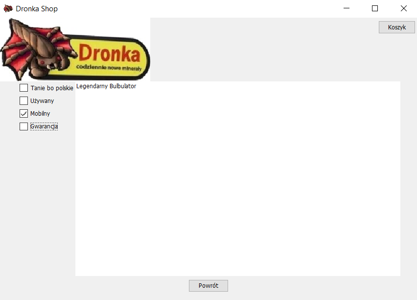

# Laboratorium 2
## Aleksandra Mazur, Grzegorz Poręba


### 1. Dodatkowe właściwości dla produktów w poszczególnych kategoriach.

Dla każdej kategorii (książki, elektronika, żywność, muzyka, sport) stworzono klasę dziedziczącą z klasy Item. Zmieniono modyfikatory dostępu atrybutów name i category w klasie Item z private na protected, aby utworzone klasy mogły z nich korzystać.


#### a) Klasa Books

Do tej klasy dodano dwa atrybuty, które rozszerzały klasę Item:

| Atrybut | Typ | Znaczenie |
|---------|-----|-----------|
|nrOfPages| int | Liczba stron|
|isHard   | boolean| Czy jest w twardej oprawie|

```java
package pl.edu.agh.dronka.shop.model.ItemTypes;

import pl.edu.agh.dronka.shop.model.Category;

public class Books extends Item {
    private int nrOfPages;
    private boolean isHard;

    public Books(String name, Category category, int price, int quantity, int nrOfPages, boolean isHard){
        super(name, category, price, quantity);
        this.nrOfPages=nrOfPages;
        this.isHard=isHard;
    }
    public Books(){}

    public int getNrOfPages() {
        return nrOfPages;
    }

    public void setNrOfPages(int nrOfPages) {
        this.nrOfPages = nrOfPages;
    }

    public boolean isHard() {
        return isHard;
    }

    public void setHard(boolean hard) {
        isHard = hard;
    }
}
```

#### b) Klasa Electronics

Do tej klasy dodano dwa atrybuty, które rozszerzały klasę Item:

| Atrybut | Typ | Znaczenie |
|---------|-----|-----------|
|isMobile| boolean | Czy jest mobilny|
|hasGuarantee   | boolean| Czy posiada gwarancję|

```java
package pl.edu.agh.dronka.shop.model.ItemTypes;

import pl.edu.agh.dronka.shop.model.Category;

public class Electronics extends Item {
    private boolean isMobile;
    private boolean hasGuarantee;

    public Electronics(String name, Category category, int price, int quantity, boolean isMobile, boolean hasGuarantee) {
        super(name, category, price, quantity);
        this.isMobile = isMobile;
        this.hasGuarantee = hasGuarantee;
    }

    public Electronics(){}

    public boolean isMobile() {
        return isMobile;
    }

    public void setMobile(boolean mobile) {
        isMobile = mobile;
    }

    public boolean isHasGuarantee() {
        return hasGuarantee;
    }

    public void setHasGuarantee(boolean hasGuarantee) {
        this.hasGuarantee = hasGuarantee;
    }
}
```

#### c) Klasa Food

Do tej klasy dodano jeden atrybut, który rozszerzał klasę Item:

| Atrybut | Typ | Znaczenie |
|---------|-----|-----------|
|expirationDate| Date | Data ważności|

```java
package pl.edu.agh.dronka.shop.model.ItemTypes;

import pl.edu.agh.dronka.shop.model.Category;

import java.util.Date;

public class Food extends Item {

    private Date expirationDate;

    public Food(String name, Category category, int price, int quantity,  Date expirationDate) {
        super(name, category, price, quantity);
        this.expirationDate=expirationDate;
    }

    public Food(){}

    public Date getExpirationDate() {
        return expirationDate;
    }

    public void setExpirationDate(Date expirationDate) {
        this.expirationDate = expirationDate;
    }
}
```

#### d) Klasa Music

Do tej klasy dodano dwa atrybuty, które rozszerzały klasę Item. Dodatkowo stworzono typ wyliczeniowy Genre o wartościach  ROCK, JAZZ, DUBSTEP, TECHNO, BLUES, COUNTRY, POP.
 

| Atrybut | Typ | Znaczenie |
|---------|-----|-----------|
|genre| Genre | Gatunek|
|hasVideo   | boolean| Czy posiada wideo|

```java
package pl.edu.agh.dronka.shop.model.ItemTypes.utils;

public enum Genre {
    ROCK("ROCK"), JAZZ("JAZZ"), DUBSTEP("DUBSTEP"), TECHNO("TECHNO"), BLUES("BLUES"), COUNTRY("COUNTRY"), POP("POP");

    private String displayName;

    Genre(String genreName) {
        this.displayName = genreName;
    }

    public static Genre parser(String genreName){
        switch(genreName.toUpperCase()){
            case "ROCK":
                return Genre.ROCK;
            case "JAZZ":
                return Genre.JAZZ;
            case "DUBSTEP":
                return Genre.DUBSTEP;
            case "TECHNO":
                return Genre.TECHNO;
            case "BLUES":
                return Genre.BLUES;
            case "COUNTRY":
                return Genre.COUNTRY;
            case "POP":
                return Genre.POP;
            default:
                throw new IllegalArgumentException("No such genre: "+  genreName.toUpperCase());
        }
    }

    public String getDisplayName() {
        return displayName;
    }
}

```

```java
package pl.edu.agh.dronka.shop.model.ItemTypes;

import pl.edu.agh.dronka.shop.model.Category;
import pl.edu.agh.dronka.shop.model.ItemTypes.utils.Genre;

public class Music extends Item {

    private Genre genre;
    private boolean hasVideo;

    public Music(String name, Category category, int price, int quantity, String genre, boolean hasVideo) {
        super(name, category, price, quantity);
        this.genre = Genre.parser(genre);
        this.hasVideo = hasVideo;
    }

    public Music(){}

    public Genre getGenre() {
        return genre;
    }

    public void setGenre(Genre genre) {
        this.genre = genre;
    }

    public boolean isHasVideo() {
        return hasVideo;
    }

    public void setHasVideo(boolean hasVideo) {
        this.hasVideo = hasVideo;
    }
}

```

#### e) Klasa Sport

Klasa ta nie posiadała dodatkowych atrybutów ponad te, które dziedziczyła po Item.

```java
package pl.edu.agh.dronka.shop.model.ItemTypes;

import pl.edu.agh.dronka.shop.model.Category;

public class Sport extends Item {

    public Sport(String name, Category category, int price, int quantity) {
        super(name, category, price, quantity);
    }
    public Sport(){}
}
```

#### f) Pliki z danymi

Zmodyfikowano również niektóre pliki csv, dodając odpowiednie pola.


#### g) Klasa ShopProvider

W klasie ShopProvider zmodyfikowano metodę ***readItems***, która tworzy obiekt z określonej klasy na podstawie kategorii.

```java
private static List<Item> readItems(CSVReader reader, Category category) {
        List<Item> items = new ArrayList<>();

        try {
            reader.parse();
            List<String[]> data = reader.getData();

            for (String[] dataLine : data) {

                String name = reader.getValue(dataLine, "Nazwa");
                int price = Integer.parseInt(reader.getValue(dataLine, "Cena"));
                int quantity = Integer.parseInt(reader.getValue(dataLine,
                        "Ilość"));

                boolean isPolish = Boolean.parseBoolean(reader.getValue(
                        dataLine, "Tanie bo polskie"));
                boolean isSecondhand = Boolean.parseBoolean(reader.getValue(
                        dataLine, "Używany"));
                
                Item item;
                switch (category) {
                    case BOOKS:
                        item = new Books(name, category, price, quantity, (int)
                                Integer.parseInt(reader.getValue(dataLine, "Liczba stron")),
                                Boolean.parseBoolean(reader.getValue(dataLine, "Twarda oprawa")));
                        break;
                    case ELECTRONICS:
                        item = new Electronics(name, category, price, quantity,
                                Boolean.parseBoolean(reader.getValue(dataLine, "Mobilny")),
                                Boolean.parseBoolean(reader.getValue(dataLine, "Gwarancja")));
                        break;
                    case FOOD:
                        String dateString = reader.getValue(dataLine, "Data przydatności");
                        SimpleDateFormat formatter = new SimpleDateFormat("yyyy-MM-dd");
                        Date date = formatter.parse(dateString);
                        item = new Food(name, category, price, quantity, date);
                        break;
					case MUSIC:
						item = new Music(name, category, price, quantity,
								reader.getValue(dataLine, "Gatunek muzyczny"),
								Boolean.parseBoolean(reader.getValue(dataLine, "Czy ma wideo")));
                        break;
					case SPORT:
						item = new Sport(name, category, price, quantity);
                        break;

					default:
						throw new IllegalArgumentException("Error parsing data from csv");
                }


                item.setPolish(isPolish);
                item.setSecondhand(isSecondhand);

                items.add(item);

            }

        } catch (IOException | ParseException e) {
            e.printStackTrace();
        }

        return items;
    }
```

#### h) Klasa PropertiesHelper

W klasie PropertiesHelper zmodyfikowano metodę ***getPropertiesMap***, tak aby oprócz cech ogólnych, wyświetlała właściwości specyficzne dla danej kategorii produktów.

```java
package pl.edu.agh.dronka.shop.model.util;

import java.util.LinkedHashMap;
import java.util.Map;

import pl.edu.agh.dronka.shop.model.ItemTypes.*;

public class PropertiesHelper {

	public static Map<String, Object> getPropertiesMap(Item item) {
		Map<String, Object> propertiesMap = new LinkedHashMap<>();
		
		propertiesMap.put("Nazwa", item.getName());
		propertiesMap.put("Cena", item.getPrice());
		propertiesMap.put("Kategoria", item.getCategory().getDisplayName()); 
		propertiesMap.put("Ilość", Integer.toString(item.getQuantity()));
		propertiesMap.put("Tanie bo polskie", item.isPolish());
		propertiesMap.put("Używany", item.isSecondhand());

		if (item instanceof Books) {
			propertiesMap.put("Liczba stron", ((Books)item).getNrOfPages());
			propertiesMap.put("Twarda oprawa", ((Books)item).isHard());
		} else if (item instanceof Electronics){
			propertiesMap.put("Mobilny", ((Electronics) item).isMobile());
			propertiesMap.put("Gwarancja", ((Electronics)item).isHasGuarantee());
		} else if(item instanceof Food){
			propertiesMap.put("Data przydatności", ((Food) item).getExpirationDate());
		} else if (item instanceof Music){
			propertiesMap.put("Gatunek muzyczny", ((Music) item).getGenre());
			propertiesMap.put("Czy ma wideo", ((Music) item).isHasVideo());
		}

		return propertiesMap;
	}
}
```

### Efekt powyższych zmian:


### 2. Rozszerzenie panelu

W celu wyświetlania produktów tak, aby było możliwe filtrowanie ich po własnościach typu boolean, specyficznych dla danej kategorii wprowadzono modyfikacje w następujących klasach.

#### a) Klasa ItemFilter

W klasie ItemFilter zmieniono konstruktor na taki, który przyjmuje parametr typu *Category* i w zależności od jego wartości tworzy obiekt z odpowiedniej klasy. Zmodyfikowano również metodę ***appliesTo***.

```java
package pl.edu.agh.dronka.shop.model.filter;

import pl.edu.agh.dronka.shop.model.Category;
import pl.edu.agh.dronka.shop.model.ItemTypes.*;

public class ItemFilter {

	private Item itemSpec = new Item();

	public ItemFilter(Category category){
		switch (category) {
			case BOOKS:
				itemSpec=new Books();
				break;
			case ELECTRONICS:
				itemSpec=new Electronics();
				break;
			case FOOD:
				itemSpec=new Food();
				break;
			case MUSIC:
				itemSpec=new Music();
				break;
			case SPORT:
				itemSpec=new Sport();
				break;
			default:
				itemSpec=new Item();
		}
	}

	public Item getItemSpec() {
		return itemSpec;
	}
	public boolean appliesTo(Item item) {
		if (itemSpec.getName() != null
				&& !itemSpec.getName().equals(item.getName())) {
			return false;
		}
		if (itemSpec.getCategory() != null
				&& !itemSpec.getCategory().equals(item.getCategory())) {
			return false;
		}

		// applies filter only if the flag (secondHand) is true)
		if (itemSpec.isSecondhand() && !item.isSecondhand()) {
			return false;
		}

		// applies filter only if the flag (polish) is true)
		if (itemSpec.isPolish() && !item.isPolish()) {
			return false;
		}

		// applies filter only if the flag (isHard) is true)
		if ((itemSpec instanceof Books) && (item instanceof Books) &&  ((Books)itemSpec).isHard() && !((Books)item).isHard()) {
			return false;
		}

		if ((itemSpec instanceof Electronics) && (item instanceof Electronics) &&  ((Electronics)itemSpec).isMobile() && !((Electronics)item).isMobile()) {
			return false;
		}

		if ((itemSpec instanceof Electronics) && (item instanceof Electronics) &&  ((Electronics)itemSpec).isHasGuarantee() && !((Electronics)item).isHasGuarantee()) {
			return false;
		}

		if ((itemSpec instanceof Music) && (item instanceof Music) && ((Music) itemSpec).isHasVideo() && ! ((Music) item).isHasVideo()) {
			return false;
		}
		return true;
	}

}
```

#### b) Klasa PropertiesPanel

W klasie PropertiesPanel obiekt filter tworzy się w metodzie ***fillProperties*** za pomocą zmodyfikowanego konstruktora. Metodę tą wzbogacono również o checkboxy odpowiednie dla danej kategorii.

```java
package pl.edu.agh.dronka.shop.view;

import java.awt.event.ActionEvent;
import java.awt.event.ActionListener;
import java.text.SimpleDateFormat;
import java.util.Date;

import javax.swing.BoxLayout;
import javax.swing.JCheckBox;
import javax.swing.JPanel;

import pl.edu.agh.dronka.shop.controller.ShopController;
import pl.edu.agh.dronka.shop.model.ItemTypes.*;
import pl.edu.agh.dronka.shop.model.filter.ItemFilter;

public class PropertiesPanel extends JPanel {

    private static final long serialVersionUID = -2804446079853846996L;
    private ShopController shopController;

    private ItemFilter filter ;

    public PropertiesPanel(ShopController shopController) {
        this.shopController = shopController;
        setLayout(new BoxLayout(this, BoxLayout.PAGE_AXIS));
    }

    public void fillProperties() {
        removeAll();
        this.filter = new ItemFilter( shopController.getCurrentCategory());

        filter.getItemSpec().setCategory(shopController.getCurrentCategory());
        add(createPropertyCheckbox("Tanie bo polskie", new ActionListener() {

            @Override
            public void actionPerformed(ActionEvent event) {
                filter.getItemSpec().setPolish(
                        ((JCheckBox) event.getSource()).isSelected());
                shopController.filterItems(filter);
            }
        }));

        add(createPropertyCheckbox("Używany", new ActionListener() {

            @Override
            public void actionPerformed(ActionEvent event) {
                filter.getItemSpec().setSecondhand(
                        ((JCheckBox) event.getSource()).isSelected());
                shopController.filterItems(filter);
            }
        }));

        switch (filter.getItemSpec().getCategory()) {
            case BOOKS:
                add(createPropertyCheckbox("Twarda oprawa", new ActionListener() {

                    @Override
                    public void actionPerformed(ActionEvent event) {
                        if (!(filter.getItemSpec() instanceof Books)) return;
                        ((Books) filter.getItemSpec()).setHard(
                                ((JCheckBox) event.getSource()).isSelected());
                        shopController.filterItems(filter);
                    }
                }));
                break;
            case ELECTRONICS:
                add(createPropertyCheckbox("Mobilny", new ActionListener() {

                    @Override
                    public void actionPerformed(ActionEvent event) {
                        if (!(filter.getItemSpec() instanceof Electronics)) return;
                        ((Electronics) filter.getItemSpec()).setMobile(
                                ((JCheckBox) event.getSource()).isSelected());
                        shopController.filterItems(filter);
                    }
                }));

                add(createPropertyCheckbox("Gwarancja", new ActionListener() {

                    @Override
                    public void actionPerformed(ActionEvent event) {
                        if (!(filter.getItemSpec() instanceof Electronics)) return;
                        ((Electronics) filter.getItemSpec()).setHasGuarantee(
                                ((JCheckBox) event.getSource()).isSelected());
                        shopController.filterItems(filter);
                    }
                }));
                break;
            case MUSIC:
                add(createPropertyCheckbox("Czy ma wideo", new ActionListener() {

                    @Override
                    public void actionPerformed(ActionEvent event) {
                        if (!(filter.getItemSpec() instanceof Music)) return;
                        ((Music) filter.getItemSpec()).setHasVideo(
                                ((JCheckBox) event.getSource()).isSelected());
                        shopController.filterItems(filter);
                    }
                }));
                break;
        }

    }

    private JCheckBox createPropertyCheckbox(String propertyName,
                                             ActionListener actionListener) {

        JCheckBox checkBox = new JCheckBox(propertyName);
        checkBox.setSelected(false);
        checkBox.addActionListener(actionListener);

        return checkBox;
    }

}
```

### Efekt powyższych zmian:




