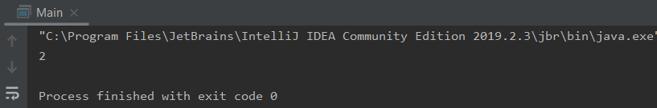
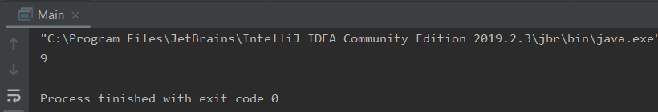
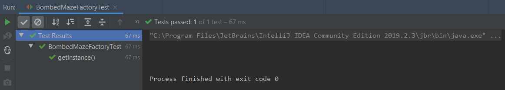
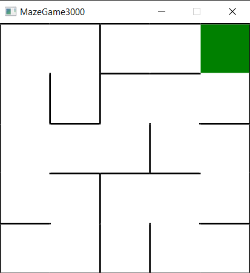
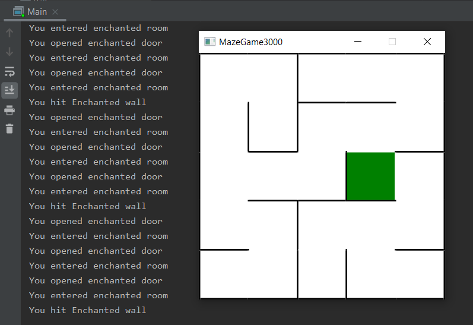

# Laboratorium 3 - Wzorce Projektowe
## Aleksandra Mazur, Grzegorz Poręba

## 4.1. Builder
### 1. Interfejs MazeBuilder
Stworzono interfejs MazeBuilder, służący do tworzenia labiryntów.

```java
package pl.agh.edu.dp.labirynth;

public interface MazeBuilder {

    void addRoom(Room room);
    void createDoor(Room r1, Room r2) throws Exception;
    void createCommonWall(Direction firstRoomDir, Room r1, Room r2) throws Exception;
}
```
### 2. Modyfikacja MazeGame
Po utworzeniu powyższego interfejsu zmodyfikowano funkcję składową tak, aby przyjmowała jako parametr obiekt tej klasy.

```java
package pl.agh.edu.dp.labirynth;

public class MazeGame {
    public Maze createMaze(MazeBuilder builder) throws Exception {
        ...
    }
}
```

### 3. Interpretacja
Obecne zmiany pozwoliły na oddzielenie tworzenia obiektów do innej klasy. Dzięki temu ten sam proces konstrukcji może prowadzić do powstania różnych reprezentacji. Unikniemy powtarzania tego samego kodu kilka razy.

### 4. Klasa StandardMazeBuilder
Do klasy Direction dodano metodę zwracającą przeciwny kierunek.
```java
package pl.agh.edu.dp.labirynth;

public enum Direction {
    North, East, South, West;

    public Direction getOppositeSide() {
        int enumI = (this.ordinal() + 2) % Direction.values().length;
        return Direction.values()[enumI];
    }
}
```

Stworzono klasę StandardMazeBuilder będącą implementacją interfejsu MazeBuilder. Posiada ona zmienną currentMaze, w której jest zapisywany obecny stan labiryntu oraz poniższe metody.

| Metoda | Typ | Znaczenie |
|---------|-----|-----------|
|addRoom| void | dodaje pokój do labiryntu i tworzy 4 ściany|
|createDoor   | void| tworzy drzwi między dwoma pokojami|
| createCommonWall | void | łączy dwa pokoje za pomocą jednej ściany wg. kierunku ściany pierwszego pokoju |
| commonWall | Direction | zwraca wspólną ścianę pomiędzy dwoma pomieszczeniami |
| getCurrentMaze | Maze | zwraca obecny stan labiryntu |


```java
package pl.agh.edu.dp.labirynth;

public class StandardMazeBuilder implements MazeBuilder {

    private Maze currentMaze;

    public StandardMazeBuilder() {
        this.currentMaze = new Maze();
    }

    @Override
    public void addRoom(Room room) {
        room.setSide(Direction.North, new Wall());
        room.setSide(Direction.East, new Wall());
        room.setSide(Direction.South, new Wall());
        room.setSide(Direction.West, new Wall());
        currentMaze.addRoom(room);
    }

    @Override
    public void createDoor(Room r1, Room r2) throws Exception {

        Direction firstRoomDir = commonWall(r1, r2);

        Door door = new Door(r1, r2);

        r1.setSide(firstRoomDir, door);
        r2.setSide(firstRoomDir.getOppositeSide(), door);
    }

    @Override
    public void createCommonWall(Direction firstRoomDir, Room r1, Room r2) throws Exception {
        MapSite side = r1.getSide(firstRoomDir);
        if (side == null)
            throw new Exception("Side doesnt exist");
        r2.setSide(firstRoomDir.getOppositeSide(), side);

    }

    private Direction commonWall(Room r1, Room r2) throws Exception {
        for (Direction dir1 : Direction.values()) {
            if (r1.getSide(dir1).equals(r2.getSide(dir1.getOppositeSide()))) {
                return dir1;
            }
        }
        throw new Exception("Rooms doesnt have common wall");
    }

    public Maze getCurrentMaze() {
        return currentMaze;
    }
}
```
### 5. Utworzenie labiryntu
Zmodyfikowano metodę createMaze, tak aby przyjmowała obiekt klasy StandardMazeBuilder, a następnie utworzono przy jej pomocy labirynt z dwoma pokojami.

```java
package pl.agh.edu.dp.labirynth;

import static pl.agh.edu.dp.labirynth.Direction.*;

public class MazeGame {
    public Maze createMaze(StandardMazeBuilder smb) throws Exception {

        Room r1 = new Room(1);
        Room r2 = new Room(2);
        smb.addRoom(r1);
        smb.addRoom(r2);

        smb.createCommonWall(South, r1, r2);
        smb.createDoor(r1, r2);

        return smb.getCurrentMaze();
    }
}
```

```java
package pl.agh.edu.dp.main;

import pl.agh.edu.dp.labirynth.*;

public class Main {

    public static void main(String[] args) throws Exception {

        MazeGame mazeGame = new MazeGame();
        StandardMazeBuilder builder = new StandardMazeBuilder();
        Maze maze = mazeGame.createMaze(builder);

        System.out.println(maze.getRoomNumbers());
    }
}
```



Jak widać powyżej liczba utworzonych pokoi została zwrócona poprawnie.

### 6. Klasa CountingMazeBuilder
Stworzono kolejną klasę implementującą interfejs MazeBuilder, która zlicza utworzone komponenty różnych obiektów.

| Metoda | Typ | Znaczenie |
|---------|-----|-----------|
|addRoom| void | dodaje 1 pokój do liczby pokoi i 4 ściany do łącznej liczby ścian|
|createDoor   | void| usuwa jedną ścianę z liczby ścian i dodaje jedne drzwi do liczby drzwi|
| createCommonWall | void | usuwa jedną ścianę z łącznej liczby ścian |
| getCounts | int | zwraca łączną sumę pokoi, drzwi i ścian |
| getRoomsNr | int | zwraca łączną liczbę pokoi |
| getDoorsNr | int | zwraca łączną liczbę drzwi |
| getWallNr | int | zwraca łączną liczbę ścian |

Trzy ostatnie metody wygenerowano używając biblioteki lombok. W dalszej części zadania również z niej korzystano.

```java
package pl.agh.edu.dp.labirynth;

import lombok.Getter;

@Getter
public class CountingMazeBuilder implements MazeBuilder {

    private int roomsNr;
    private int doorsNr;
    private int wallNr;

    public CountingMazeBuilder() {
        this.roomsNr = 0;
        this.doorsNr = 0;
        this.wallNr = 0;
    }
    
    @Override
    public void addRoom(Room room) {
        roomsNr ++;
        wallNr += 4;
    }

    @Override
    public void createDoor(Room r1, Room r2) throws Exception {
        wallNr --;
        doorsNr ++;
    }

    @Override
    public void createCommonWall(Direction firstRoomDir, Room r1, Room r2) throws Exception {
        wallNr --;
    }

    public int getCounts(){
        return roomsNr + wallNr + doorsNr;
    }

}
```

Przetestowano działanie utworzonej klasy zmieniając tymczasowo kod w metodzie createMaze, tak aby przyjmowała obiekt klasy CountingMazeBuilder.

```java
package pl.agh.edu.dp.labirynth;

import static pl.agh.edu.dp.labirynth.Direction.*;

public class MazeGame {
    public void createMaze(CountingMazeBuilder cmb) throws Exception {

        Room r1 = new Room(1);
        Room r2 = new Room(2);
        cmb.addRoom(r1);
        cmb.addRoom(r2);

        cmb.createCommonWall(South, r1, r2);
        cmb.createDoor(r1, r2);

        System.out.println(cmb.getCounts());
    }
}
```



Jak widać powyżej, suma wszystkich pokoi, drzwi i ścian została obliczona poprawnie (2 pokoje + 6 ścian + 1 drzwi).

## 4.2 Fabryka abstrakcyjna
Po zapoznaniu się z treścią kolejnych poleceń, stworzono klasę Vector2d, obrazującą współrzędne obiektu na mapie.

| Metoda | Typ | Znaczenie |
|---------|-----|-----------|
|nextPos| Vector2d | zwraca pozycję, na którą powinien przemieścić się obiekt po udaniu się w danym kierunku |
|lowerRight | Vector2d | zwraca nowy wektor o maksymalnych współrzędnych |

```java
package pl.agh.edu.dp.labirynth.Utils;

import lombok.AllArgsConstructor;
import lombok.EqualsAndHashCode;
import lombok.ToString;

@AllArgsConstructor
@EqualsAndHashCode
@ToString
public class Vector2d {
    final public int x;
    final public int y;

    public Vector2d nextPos(Direction dir) {
        switch (dir) {
            case South:
                return new Vector2d(this.x, this.y - 1);
            case East:
                return new Vector2d(this.x + 1, this.y);
            case West:
                return new Vector2d(this.x - 1, this.y);
            case North:
                return new Vector2d(this.x, this.y + 1);
        }
        throw new NullPointerException("Pos doesnt exist");
    }


    public Vector2d lowerRight(Vector2d other) {
        return new Vector2d(Math.max(this.x, other.x), Math.max(this.y, other.y));
    }
}
```

Do klasy Maze dodano metodę findRoom - zwracającą pokój w labiryncie, znajdujący się na danej pozycji.

```java
package pl.agh.edu.dp.labirynth;

import lombok.Getter;
import pl.agh.edu.dp.labirynth.MazeElements.Rooms.Room;
import pl.agh.edu.dp.labirynth.Utils.Vector2d;
import java.util.Optional;
import java.util.Vector;

@Getter
public class Maze {

    private Vector<Room> rooms;

    public Maze() {
        this.rooms = new Vector<Room>();
    }

    public void addRoom(Room room){
        rooms.add(room);
    }

    public Room findRoom(Vector2d pos) throws Exception {
        Optional<Room> foundRoom =  rooms.stream().filter(room -> room.getPosition().equals(pos)).findAny();
        if(foundRoom.isPresent()) return foundRoom.get();
        throw new Exception("Error: Room with that number doesnt exist");
    }

    public int getRoomNumbers() {
        return rooms.size();
    }
}
```

Następnie do klasy Room dodano zmienną Vector2d odwzorowującą pozycję w labiryncie.

```java
package pl.agh.edu.dp.labirynth.MazeElements.Rooms;

import lombok.Getter;
import pl.agh.edu.dp.labirynth.MazeElements.MapSite;
import pl.agh.edu.dp.labirynth.Utils.Direction;
import pl.agh.edu.dp.labirynth.Utils.Vector2d;

import java.util.EnumMap;
import java.util.Map;

public class Room extends MapSite {
    @Getter
    private Vector2d position;
    @Getter
    private Map<Direction, MapSite> sides;


    public Room(Vector2d position) {
        this.sides = new EnumMap<>(Direction.class);
        this.position = position;
    }

    public MapSite getSide(Direction direction) {
        return this.sides.get(direction);
    }

    public void setSide(Direction direction, MapSite ms) {
        this.sides.put(direction, ms);
    }

    @Override
    public void Enter() {
        System.out.println("You entered normal room");
    }
}
```

### 1. Klasa MazeFactory
Stworzono klasę MazeFactory, służącą do tworzenia elementów labiryntu, o następujących metodach:

| Metoda | Typ | Znaczenie |
|---------|-----|-----------|
|createRoom| Room | tworzy pokój na określonej pozycji|
|createDoor   | Door| tworzy drzwi między dwoma pokojami|
| createWall | Wall | tworzy ścianę |

```java
package pl.agh.edu.dp.labirynth.Factory;

import pl.agh.edu.dp.labirynth.MazeElements.Doors.Door;
import pl.agh.edu.dp.labirynth.MazeElements.Rooms.Room;
import pl.agh.edu.dp.labirynth.MazeElements.Walls.Wall;
import pl.agh.edu.dp.labirynth.Utils.Vector2d;

public class MazeFactory {

    public Door createDoor(Room r1, Room r2) {
        return new Door(r1, r2);
    }

    public Room createRoom(Vector2d pos) {
        return new Room(pos);
    }

    public Wall createWall() {
        return new Wall();
    }
}
```

### 2. Funkcja createMaze
Przeprowadzono kolejną modyfikację funkcji createMaze tak, aby jako parametr przyjmowała obiekt MazeFactory.

```java
package pl.agh.edu.dp.labirynth;

import static pl.agh.edu.dp.labirynth.Direction.*;

public class MazeGame {
    public Maze createMaze(CountingMazeBuilder builder, MazeFactory factory) throws Exception {

        Room r1 = factory.createRoom(1);
        Room r2 = factory.createRoom(2);

        builder.addRoom(r1);
        builder.addRoom(r2);

        builder.createCommonWall(South, r1, r2);
        builder.createDoor(r1, r2);

        return builder.getCurrentMaze();
    }
}
```

### 3. Klasa EnchantedMazeFactory
Stworzono klasy reprezentujące magiczne pokoje, drzwi i ściany, dziedziczące odpowiednio po klasach Room, Door, Wall.

Klasa EnchantedRoom:
```java
package pl.agh.edu.dp.labirynth.MazeElements.Rooms;

import pl.agh.edu.dp.labirynth.Utils.Vector2d;

public class EnchantedRoom extends Room {

    public EnchantedRoom(Vector2d position) {
        super(position);
    }

    @Override
    public void Enter() {
        System.out.println("You entered enchanted room");
    }

}
```

Klasa EnchantedDoor:
```java
package pl.agh.edu.dp.labirynth.MazeElements.Doors;

import pl.agh.edu.dp.labirynth.MazeElements.Rooms.Room;

public class EnchantedDoor extends Door {
    public EnchantedDoor(Room r1, Room r2) {
        super(r1, r2);
    }

    @Override
    public void Enter() throws Exception {
        System.out.println("You opened enchanted door");
    }
}
```

Klasa EnchantedWall:
```java
package pl.agh.edu.dp.labirynth.MazeElements.Walls;

public class EnchantedWall extends Wall {

    @Override
    public void Enter(){
        System.out.println("You hit Enchanted wall");

    }
}
```

Następnie stworzono klasę EnchantedMazeFactory (fabryka magicznych labiryntów), która dziedziczy z MazeFactory.

```java
package pl.agh.edu.dp.labirynth.Factory;

import pl.agh.edu.dp.labirynth.Factory.MazeFactory;
import pl.agh.edu.dp.labirynth.MazeElements.Doors.Door;
import pl.agh.edu.dp.labirynth.MazeElements.Doors.EnchantedDoor;
import pl.agh.edu.dp.labirynth.MazeElements.Rooms.EnchantedRoom;
import pl.agh.edu.dp.labirynth.MazeElements.Rooms.Room;
import pl.agh.edu.dp.labirynth.MazeElements.Walls.EnchantedWall;
import pl.agh.edu.dp.labirynth.MazeElements.Walls.Wall;
import pl.agh.edu.dp.labirynth.Utils.Vector2d;

public class EnchantedMazeFactory extends MazeFactory {

    @Override
    public Door createDoor(Room r1, Room r2) {
        return new EnchantedDoor(r1, r2);
    }

    @Override
    public Room createRoom(Vector2d pos) {
        return new EnchantedRoom(pos);
    }

    @Override
    public Wall createWall() {
        return new EnchantedWall();
    }
}
```

### 4. Klasa BombedMazeFactory
Stworzono klasy reprezentujące pokoje, drzwi i ściany, dziedziczące odpowiednio po klasach Room, Door, Wall.

Klasa BombedRoom:
```java
package pl.agh.edu.dp.labirynth.MazeElements.Rooms;

import pl.agh.edu.dp.labirynth.Utils.Vector2d;

public class BombedRoom extends Room {

    public BombedRoom(Vector2d position) {
        super(position);
    }

    @Override
    public void Enter(){
        System.out.println("You entered bombed room");
    }
}
```

Klasa BombedDoor:
```java
package pl.agh.edu.dp.labirynth.MazeElements.Doors;

import pl.agh.edu.dp.labirynth.MazeElements.Rooms.Room;

public class BombedDoor extends Door {
    public BombedDoor(Room r1, Room r2) {
        super(r1, r2);
    }

    @Override
    public void Enter() throws Exception {
        System.out.println("You opened bombed door");
    }
}
```

Klasa BombedWall:
```java
package pl.agh.edu.dp.labirynth.MazeElements.Walls;

public class BombedWall extends Wall {

    @Override
    public void Enter(){
        System.out.println("You hit bombed wall");

    }
}
```

Następnie stworzono klasę BombedMazeFactory, która dziedziczy z MazeFactory.

```java
package pl.agh.edu.dp.labirynth.Factory;


import pl.agh.edu.dp.labirynth.MazeElements.Doors.BombedDoor;
import pl.agh.edu.dp.labirynth.MazeElements.Doors.Door;
import pl.agh.edu.dp.labirynth.MazeElements.Rooms.BombedRoom;
import pl.agh.edu.dp.labirynth.MazeElements.Rooms.Room;
import pl.agh.edu.dp.labirynth.MazeElements.Walls.BombedWall;
import pl.agh.edu.dp.labirynth.MazeElements.Walls.Wall;
import pl.agh.edu.dp.labirynth.Utils.Vector2d;

public class BombedMazeFactory extends MazeFactory{

    @Override
    public Door createDoor(Room r1, Room r2) {
        return new BombedDoor(r1, r2);
    }

    @Override
    public Room createRoom(Vector2d pos) {
        return new BombedRoom(pos);
    }

    @Override
    public Wall createWall() {
        return new BombedWall();
    }
}
```

## 4.3 Singleton
Aby MazeFactory było Singletonem do klas MazeFactory, EnchantedMazeFactory i BombedMazeFactor, dodano ich statyczne instancje i metody getInstance.

Klasa MazeFactory:
```java
package pl.agh.edu.dp.labirynth.Factory;

public class MazeFactory {

    private static MazeFactory instance;

    public static MazeFactory getInstance(){
        if( instance == null){
            instance = new MazeFactory();
        }
        return instance;
    }

    ...
}
```

Klasa EnchantedMazeFactory:
```java
package pl.agh.edu.dp.labirynth.Factory;

public class EnchantedMazeFactory extends MazeFactory {

    private static EnchantedMazeFactory instance;

    public static EnchantedMazeFactory getInstance(){
        if( instance == null){
            instance = new EnchantedMazeFactory();
        }
        return instance;
    }

    ...
}
```

Klasa BombedMazeFactory:
```java
package pl.agh.edu.dp.labirynth.Factory;

public class BombedMazeFactory extends MazeFactory{

    private static BombedMazeFactory instance;

    public static BombedMazeFactory getInstance(){
        if( instance == null){
            instance = new BombedMazeFactory();
        }
        return instance;
    }

    ...
}
```

Następnie do klasy StandardMazeBuilder dodano atrybut MazeFactory i zmodyfikowano metodę createDoorBetweenRooms, tworząc Drzwi za pomocą fabryki.

```java
package pl.agh.edu.dp.labirynth.Builder;

import lombok.Getter;
import pl.agh.edu.dp.labirynth.*;
import pl.agh.edu.dp.labirynth.Factory.MazeFactory;
import pl.agh.edu.dp.labirynth.MazeElements.Doors.Door;
import pl.agh.edu.dp.labirynth.MazeElements.MapSite;
import pl.agh.edu.dp.labirynth.MazeElements.Rooms.Room;
import pl.agh.edu.dp.labirynth.MazeElements.Walls.Wall;
import pl.agh.edu.dp.labirynth.Utils.Direction;
import pl.agh.edu.dp.labirynth.Utils.Vector2d;

public class StandardMazeBuilder implements MazeBuilder {

    @Getter
    Maze currentMaze;
    private MazeFactory factory;

    public StandardMazeBuilder(MazeFactory factory) {
        this.currentMaze = new Maze();
        this.factory=factory;
    }


    @Override
    public void addRoom(Room room) {
        room.setSide(Direction.North, factory.createWall());
        room.setSide(Direction.East, factory.createWall());
        room.setSide(Direction.South, factory.createWall());
        room.setSide(Direction.West, factory.createWall());
        currentMaze.addRoom(room);
    }

    @Override
    public void createDoorBetweenRooms(Room r1, Room r2) throws Exception {

        Direction firstRoomDir = commonWall(r1, r2);

        Door door = factory.createDoor(r1, r2);

        r1.setSide(firstRoomDir, door);
        r2.setSide(firstRoomDir.getOppositeSide(), door);
    }

    @Override
    public void createCommonWall(Direction firstRoomDir, Room r1, Room r2) throws Exception {
        MapSite side = r1.getSide(firstRoomDir);
        r2.setSide(firstRoomDir.getOppositeSide(), side);

    }

    private Direction commonWall(Room r1, Room r2) throws Exception {
        for (Direction dir1 : Direction.values()) {
            if (r1.getSide(dir1).equals(r2.getSide(dir1.getOppositeSide()))) {
                return dir1;
            }
        }
        throw new Exception("Rooms doesnt have common wall");
    }

    public Room findRoom(Vector2d pos) throws Exception {
        return currentMaze.findRoom(pos);
    }
}
```

## 4.4 Rozszerzenie aplikacji labirynt
### a) Mechanizm przemieszczania się po labiryncie
Stworzono klasę Player, która za pomocą strzałek będzie mogła zadecydować o kierunku chodzenia.

| Atrybut | Typ | Znaczenie |
|---------|-----|-----------|
|currentRoom| Room | pokój, w którym obecnie znajduje się gracz|
|pos   | Vector2d| pozycja, na której znajduje się gracz|

```java
package pl.agh.edu.dp.labirynth;

import lombok.AllArgsConstructor;
import lombok.Getter;
import lombok.Setter;
import pl.agh.edu.dp.labirynth.MazeElements.Rooms.Room;
import pl.agh.edu.dp.labirynth.Utils.Vector2d;

@AllArgsConstructor
@Setter
@Getter
public class Player {

    Room currentRoom;
    Vector2d pos;
}
```
Zrezygnowano z prostego wyświetlania, ponieważ wykonano podpunkt **4.5** i zaimplementowano wizualizację w JavaFX (kod we wspomnianym podpunkcie).


### b) Przetestowanie Singletonu
Poniżej sprawdzono, czy MazeFactory jest Singletonem.
```java
package pl.agh.edu.dp.labirynth.Factory;

import org.junit.jupiter.api.Test;
import static org.junit.Assert.*;

class BombedMazeFactoryTest {

    @Test
    void getInstance() {
        MazeFactory factory = EnchantedMazeFactory.getInstance();

        assertEquals(factory, EnchantedMazeFactory.getInstance());
        assertEquals(factory, EnchantedMazeFactory.getInstance());
        assertEquals(factory, EnchantedMazeFactory.getInstance());

        MazeFactory factory2 = BombedMazeFactory.getInstance();

        assertEquals(factory2, BombedMazeFactory.getInstance());
        assertNotEquals(factory, factory2);
    }
}
```



Jak widać powyżej, testy przebiegły pomyślnie. Zatem MazeFactory faktycznie jest Singletonem.

## 4.5 Dla chętnych!
Dodano prostą wizualizację wykorzystując bibliotekę **JavaFX**.

### Klasa Door
Rozszerzono klasę Door o kilka metod.

| Metoda | Typ | Znaczenie |
|---------|-----|-----------|
|getRoomAtOthersSide| Room | zwraca pokój, znajdujący się po drugiej stronie drzwi|
|movePlayerToOtherSide   | void| przenosi gracza do pokoju, po drugiej stronie drzwi|
|enter   | void| przejście przez drzwi|


```java
package pl.agh.edu.dp.labirynth.MazeElements.Doors;

import lombok.AllArgsConstructor;
import lombok.Getter;
import lombok.Setter;
import pl.agh.edu.dp.labirynth.MazeElements.MapSite;
import pl.agh.edu.dp.labirynth.MazeElements.Rooms.Room;
import pl.agh.edu.dp.labirynth.MazeGame;

@Getter
@Setter
@AllArgsConstructor
public class Door extends MapSite {
    private Room room1;
    private Room room2;

    public Room getRoomAtOthersSide(Room firstR) {
        return room1 == firstR ? room2 : room1;
    }

    void movePlayerToOtherSide() throws Exception {
        Room newRoom = getRoomAtOthersSide(MazeGame.getInstance().getPlayer().getCurrentRoom());
        newRoom.Enter();
        MazeGame.getInstance().movePlayerTo(newRoom);
    }

    @Override
    public void Enter() throws Exception {
        System.out.println("You opened normal door");
        movePlayerToOtherSide();
    }

}
```

### Klasa BombedDoor
Dopisano do metody Enter wywołanie metody movePlayerToOtherSide.

```java
package pl.agh.edu.dp.labirynth.MazeElements.Doors;

public class BombedDoor extends Door {
    ...

    @Override
    public void Enter() throws Exception {
        System.out.println("You opened bombed door");
        movePlayerToOtherSide();
    }
}
```

### Klasa EnchantedDoor
Powyższą czynność powtórzono również dla tej klasy.

```java
package pl.agh.edu.dp.labirynth.MazeElements.Doors;

public class EnchantedDoor extends Door {
    ...

    @Override
    public void Enter() throws Exception {
        System.out.println("You opened enchanted door");
        movePlayerToOtherSide();
    }
}
```

### Interfejs MazeBuilder
Do interfejsu dodano metodę findRoom, znajdującą pokój na danej pozycji.

```java
package pl.agh.edu.dp.labirynth.Builder;

import pl.agh.edu.dp.labirynth.Utils.Direction;
import pl.agh.edu.dp.labirynth.MazeElements.Rooms.Room;
import pl.agh.edu.dp.labirynth.Utils.Vector2d;

public interface MazeBuilder {

    void addRoom(Room room);
    void createDoorBetweenRooms(Room r1, Room r2) throws Exception;
    void createCommonWall(Direction firstRoomDir, Room r1, Room r2) throws Exception;
    Room findRoom(Vector2d pos) throws Exception;
}
```

### Klasa CountingMazeBuilder
Zmieniono klasę CountingMazeBuilder z klasy implementującej interfejs MazeBuilder na klasę rozszerzającą StandardMazeBuilder. Dodano do niej atrybut RightLowerPos reprezentujący pozycję prawego - dolnego rogu na mapie (lewy - górny to punkt (0,0)). Zmodyfikowano również metodę addRoom tak, aby przy każdym dodaniu pokoju, modyfikowała graniczny punkt na mapie.

```java
package pl.agh.edu.dp.labirynth.Builder;

import lombok.Getter;
import pl.agh.edu.dp.labirynth.Factory.MazeFactory;
import pl.agh.edu.dp.labirynth.Utils.Direction;
import pl.agh.edu.dp.labirynth.MazeElements.Rooms.Room;
import pl.agh.edu.dp.labirynth.Utils.Vector2d;

@Getter
public class CountingMazeBuilder extends StandardMazeBuilder {

    private int roomsNr;
    private int doorsNr;
    private int wallNr;
    private Vector2d RightLowerPos;

    public CountingMazeBuilder(MazeFactory factory) {
        super(factory);
        this.roomsNr = 0;
        this.doorsNr = 0;
        this.wallNr = 0;
        RightLowerPos = new Vector2d(0, 0);
    }

    @Override
    public void addRoom(Room room) {
        super.addRoom(room);
        roomsNr++;
        wallNr += 4;

        RightLowerPos = RightLowerPos.lowerRight(room.getPosition());
    }

    @Override
    public void createDoorBetweenRooms(Room r1, Room r2) throws Exception {
        super.createDoorBetweenRooms(r1,r2);
        wallNr--;
        doorsNr++;
    }

    @Override
    public void createCommonWall(Direction firstRoomDir, Room r1, Room r2) throws Exception {
        super.createCommonWall(firstRoomDir, r1, r2);
        wallNr--;
    }

    public int getCounts() {
        return roomsNr + wallNr + doorsNr;
    }
}
```

### Klasa MazeGame
Znacznie rozbudowano klasę MazeGame dodając do niej poniższe atrybuty i metody.

| Atrybut | Typ | Znaczenie |
|---------|-----|-----------|
|maze| Maze | labirynt|
|player | Player| gracz|
|rightLowerPos   | Vector2d| współrzędne graniczne prawego - dolnego rogu|
|instance   | MazeGame| instancja gry|

| Metoda | Typ | Znaczenie |
|---------|-----|-----------|
|getInstance| MazeGame | zwraca instancję gry lub jeżeli gra nie istnieje - to ją tworzy|
|createMaze   | void| tworzy labirynt |
|makeMove   | void| wykonuje ruch gracza w danym kierunku|
|movePlayerTo   | void| zmienia obecny pokój i współrzędne gracza na nowe|
|createPlayerAt   | void| tworzy gracza na danej pozycji|
|buildSampleMaze   | void| buduje przykładowy labirynt|


```java
package pl.agh.edu.dp.labirynth;

import lombok.Getter;
import lombok.Setter;
import pl.agh.edu.dp.labirynth.Builder.CountingMazeBuilder;
import pl.agh.edu.dp.labirynth.Factory.BombedMazeFactory;
import pl.agh.edu.dp.labirynth.MazeElements.Doors.Door;
import pl.agh.edu.dp.labirynth.MazeElements.MapSite;
import pl.agh.edu.dp.labirynth.MazeElements.Walls.Wall;
import pl.agh.edu.dp.labirynth.Utils.*;
import pl.agh.edu.dp.labirynth.Builder.StandardMazeBuilder;
import pl.agh.edu.dp.labirynth.Factory.EnchantedMazeFactory;
import pl.agh.edu.dp.labirynth.Factory.MazeFactory;
import pl.agh.edu.dp.labirynth.MazeElements.Rooms.Room;

import static pl.agh.edu.dp.labirynth.Utils.Direction.*;

@Getter
@Setter
public class MazeGame {

    private Maze maze;
    private Player player;
    private Vector2d rightLowerPos;

    private static MazeGame instance;

    public static MazeGame getInstance() {
        if( instance == null){
            instance = new MazeGame();
        }
        return instance;
    }


    public void createMaze(CountingMazeBuilder builder, MazeFactory factory) throws Exception {
        buildSampleMaze(builder, factory);
        this.rightLowerPos = builder.getRightLowerPos();
        this.maze= builder.getCurrentMaze();
    }

    public void makeMove(Direction dir) throws Exception {
        MapSite side = player.currentRoom.getSide(dir);
        side.Enter();

    }

    public void movePlayerTo(Room room){
        player.setCurrentRoom(room);
        player.setPos(room.getPosition());
    }

    public void createPlayerAt(Vector2d playerPos) throws Exception {
        this.player = new Player(maze.findRoom(playerPos), playerPos);
    }


    /* below sample 5 by 5 maze hardcoded for simplicity */
    private void buildSampleMaze(CountingMazeBuilder builder, MazeFactory factory) throws Exception {

        /* Add every room and make common walls with neighbours */
        for (int i = 0; i < 5; i++) {
            for (int j = 0; j < 5; j++) {
                Room currRoom = factory.createRoom(new Vector2d(i, j));
                builder.addRoom(currRoom);

                if (j > 0)
                    builder.createCommonWall(North, currRoom, builder.findRoom(new Vector2d(i, j - 1)));
                if (i > 0)
                    builder.createCommonWall(West, currRoom, builder.findRoom(new Vector2d(i - 1, j)));
            }
        }

        /* long code ahead, nothing else at bottom ;) */
        builder.createDoorBetweenRooms(
                builder.findRoom(new Vector2d(0, 0)),
                builder.findRoom(new Vector2d(1, 0))
        );

        builder.createDoorBetweenRooms(
                builder.findRoom(new Vector2d(0, 0)),
                builder.findRoom(new Vector2d(0, 1))
        );

        builder.createDoorBetweenRooms(
                builder.findRoom(new Vector2d(0, 1)),
                builder.findRoom(new Vector2d(0, 2))
        );

        builder.createDoorBetweenRooms(
                builder.findRoom(new Vector2d(1, 0)),
                builder.findRoom(new Vector2d(1, 1))
        );
        builder.createDoorBetweenRooms(
                builder.findRoom(new Vector2d(0, 2)),
                builder.findRoom(new Vector2d(1, 2))
        );

        builder.createDoorBetweenRooms(
                builder.findRoom(new Vector2d(0, 2)),
                builder.findRoom(new Vector2d(0, 3))
        );

        builder.createDoorBetweenRooms(
                builder.findRoom(new Vector2d(1, 3)),
                builder.findRoom(new Vector2d(0, 3))
        );

        builder.createDoorBetweenRooms(
                builder.findRoom(new Vector2d(1, 3)),
                builder.findRoom(new Vector2d(1, 4))
        );

        builder.createDoorBetweenRooms(
                builder.findRoom(new Vector2d(0, 4)),
                builder.findRoom(new Vector2d(1, 4))
        );
        builder.createDoorBetweenRooms(
                builder.findRoom(new Vector2d(2, 0)),
                builder.findRoom(new Vector2d(3, 0))
        );
        builder.createDoorBetweenRooms(
                builder.findRoom(new Vector2d(4, 0)),
                builder.findRoom(new Vector2d(3, 0))
        );
        builder.createDoorBetweenRooms(
                builder.findRoom(new Vector2d(4, 0)),
                builder.findRoom(new Vector2d(4, 1))
        );
        builder.createDoorBetweenRooms(
                builder.findRoom(new Vector2d(4, 0)),
                builder.findRoom(new Vector2d(4, 1))
        );
        builder.createDoorBetweenRooms(
                builder.findRoom(new Vector2d(3, 1)),
                builder.findRoom(new Vector2d(4, 1))
        );
        builder.createDoorBetweenRooms(
                builder.findRoom(new Vector2d(3, 1)),
                builder.findRoom(new Vector2d(2, 1))
        );
        builder.createDoorBetweenRooms(
                builder.findRoom(new Vector2d(2, 2)),
                builder.findRoom(new Vector2d(2, 1))
        );
        builder.createDoorBetweenRooms(
                builder.findRoom(new Vector2d(2, 2)),
                builder.findRoom(new Vector2d(1, 2))
        );
        builder.createDoorBetweenRooms(
                builder.findRoom(new Vector2d(3, 1)),
                builder.findRoom(new Vector2d(3, 2))
        );
        builder.createDoorBetweenRooms(
                builder.findRoom(new Vector2d(4, 2)),
                builder.findRoom(new Vector2d(3, 2))
        );
        builder.createDoorBetweenRooms(
                builder.findRoom(new Vector2d(4, 2)),
                builder.findRoom(new Vector2d(4, 3))
        );
        builder.createDoorBetweenRooms(
                builder.findRoom(new Vector2d(3, 3)),
                builder.findRoom(new Vector2d(4, 3))
        );
        builder.createDoorBetweenRooms(
                builder.findRoom(new Vector2d(3, 3)),
                builder.findRoom(new Vector2d(3, 4))
        );
        builder.createDoorBetweenRooms(
                builder.findRoom(new Vector2d(4, 4)),
                builder.findRoom(new Vector2d(3, 4))
        );
        builder.createDoorBetweenRooms(
                builder.findRoom(new Vector2d(3, 3)),
                builder.findRoom(new Vector2d(2, 3))
        );
        builder.createDoorBetweenRooms(
                builder.findRoom(new Vector2d(2, 4)),
                builder.findRoom(new Vector2d(2, 3))
        );
    }

}
```

## GUI
Stworzono dwie klasy: GameFrame i GameScene do wizualizacji aplikacji, używając JavaFX.

### Klasa GameFrame


Z powodu ograniczeń jakie niesie ze sobą rozszerzenie klasy o Application nie możnabyło napisać konstruktora i do niego przekazać zmienne typu builder czy Factory. Z tego powodu utworzono osobną funkcję `SetupMaze(s)` w której można łatwo edytować tytuł, z jakiego factory oraz buildera korzystamy oraz pozycje startową gracza, a także wielkość pokoi oraz grubość scian.

Funkcja start przygotowywuje okno i inicjuje `GameScene`, które bedzie odpowiedzialne za renderowanie graficzne oraz dodaje akcje wykonywane przy wcisnieciu klawiszy strzałek


```java
package pl.agh.edu.dp.gui;

import javafx.application.Application;
import javafx.application.Platform;
import javafx.scene.layout.Pane;
import javafx.stage.Stage;
import pl.agh.edu.dp.labirynth.Builder.CountingMazeBuilder;
import pl.agh.edu.dp.labirynth.Factory.BombedMazeFactory;
import pl.agh.edu.dp.labirynth.Factory.EnchantedMazeFactory;
import pl.agh.edu.dp.labirynth.Factory.MazeFactory;
import pl.agh.edu.dp.labirynth.MazeGame;
import pl.agh.edu.dp.labirynth.Utils.Vector2d;

import static pl.agh.edu.dp.labirynth.Utils.Direction.*;


public class GameFrame extends Application {


    /* ================= Edit here  ================= */
    static final int PIXEL_SIZE = 64;
    static final int WALL_THICKNESS = 2;

    private void SetupMaze(Stage stage) throws Exception {
        stage.setTitle("MazeGame3000");

        /* What factory and builder */
        MazeFactory factory = EnchantedMazeFactory.getInstance();
        CountingMazeBuilder builder = new CountingMazeBuilder(factory);

        mazeGame.createMaze(builder, factory);

        /* Starting pos of player */
        Vector2d playerPos = new Vector2d(4, 0);

        mazeGame.createPlayerAt(playerPos);
    }

    /* ================= GameFrame  ================= */

    private MazeGame mazeGame;

    @Override
    public void start(Stage stage) throws Exception {

        this.mazeGame =  MazeGame.getInstance();
        SetupMaze(stage);
        int mapHeight = (mazeGame.getRightLowerPos().y + 1) * PIXEL_SIZE + (mazeGame.getRightLowerPos().y + 2) * WALL_THICKNESS;
        int mapWidth = (mazeGame.getRightLowerPos().x + 1) * PIXEL_SIZE + (mazeGame.getRightLowerPos().x + 2) * WALL_THICKNESS;

        stage.setResizable(false);
        stage.setOnCloseRequest(event -> Platform.exit());

        Pane rootNode = new Pane();
        GameScene gameScene = new GameScene(rootNode, mapWidth, mapHeight);
        refresh(gameScene);
        gameScene.setOnKeyPressed(event -> {

            try {
                switch (event.getCode()) {
                    case LEFT:
                        mazeGame.makeMove(West);
                        break;
                    case RIGHT:
                        mazeGame.makeMove(East);
                        break;
                    case DOWN:
                        mazeGame.makeMove(South);
                        break;
                    case UP:
                        mazeGame.makeMove(North);
                        break;
                }
            }catch (Exception e){
                e.printStackTrace();
            }
            refresh(gameScene);

        });
        stage.setScene(gameScene);
        stage.show();

    }

    private void refresh(GameScene gameScene) {
        gameScene.genTiles(
                mazeGame.getMaze().getRooms(),
                mazeGame.getPlayer().getPos(),
                mazeGame.getRightLowerPos()
        );
    }


    public void show(String[] args){
        launch(args);
    }
}
```

### Klasa GameScene
Stworzono klasę GameScene rozszerzającą Scene.

Dodano funcje pomocnicze 

`getRoomPosOnCanvas(Vector2d relativeRoomPos)` która na podstawie współrzędnych prostych tzn kazdy potencjalny pokój to jedno pole na układzie współrzednych oblicza lewy górny róg obiektu, który może być potem narysowany.

`addRectangle(int width, int height, int x, int y, Group tileGroup, Color color)` która agreguje w jedną funkcje proces tworzenia prostokąta oraz dodaje do podane w funkcji grupy ten prostokąt 

Funkcja główna `genTiles` przyjmuje pokoje, pozycje gracza oraz lewy dolny róg, ten ostatni pomaga nam w narysowaniu małych pixeli na rogach pokoi.

Prostokąty odpowiadające za sciany są generowane poprzez sprawdzanie obecnosci scian dla każdego pokoju i generowaniu odpowiednich prostokątów (raz poziomych, raz pionowych) o rozmiarach wyliczonych relatywnie do lewego górnego rogu). Jest to pewne uproszczenie w kodzie, które skutkuje teorytyczny "dwukrotnym" narysowaniem niektórych scian

```java
package pl.agh.edu.dp.gui;

import javafx.scene.Group;
import javafx.scene.Scene;
import javafx.scene.layout.Pane;
import pl.agh.edu.dp.labirynth.MazeElements.Rooms.Room;
import pl.agh.edu.dp.labirynth.MazeElements.Walls.Wall;
import pl.agh.edu.dp.labirynth.Utils.Vector2d;
import javafx.scene.shape.Rectangle;
import javafx.scene.paint.Color;

import java.util.Vector;

import static pl.agh.edu.dp.gui.GameFrame.PIXEL_SIZE;
import static pl.agh.edu.dp.gui.GameFrame.WALL_THICKNESS;
import static pl.agh.edu.dp.labirynth.Utils.Direction.*;

class GameScene extends Scene {

    private Group group;

    GameScene(Pane rootPane, int width, int height) {
        super(rootPane, width, height);
        group = new Group();
        rootPane.getChildren().add(group);
    }

    void genTiles(Vector<Room> rooms, Vector2d playerPos, Vector2d lowerRight) {
        group.getChildren().clear();

        /* Generates pixels at corners, so there isn't weird space */
        Group cornerGroup = new Group();
        for (int i = 0; i <= lowerRight.x + 1; i++) {
            for (int j = 0; j <= lowerRight.y + 1; j++) {
                Vector2d posOnCanvas = getRoomPosOnCanvas(new Vector2d(i, j));
                addRectangle(WALL_THICKNESS, WALL_THICKNESS, posOnCanvas.x, posOnCanvas.y, cornerGroup, Color.BLACK);
            }
        }
        group.getChildren().add(cornerGroup);

        rooms.forEach(room -> {

            Vector2d posOnCanvas = getRoomPosOnCanvas(room.getPosition());
            Group tileGroup = new Group();

            if (room.getSide(North) instanceof Wall)
                addRectangle(PIXEL_SIZE, WALL_THICKNESS, posOnCanvas.x + WALL_THICKNESS, posOnCanvas.y, tileGroup, Color.BLACK);

            if (room.getSide(East) instanceof Wall)
                addRectangle(WALL_THICKNESS, PIXEL_SIZE, posOnCanvas.x + WALL_THICKNESS + PIXEL_SIZE, posOnCanvas.y + WALL_THICKNESS, tileGroup, Color.BLACK);

            if (room.getSide(South) instanceof Wall)
                addRectangle(PIXEL_SIZE, WALL_THICKNESS, posOnCanvas.x + WALL_THICKNESS, posOnCanvas.y + WALL_THICKNESS + PIXEL_SIZE, tileGroup, Color.BLACK);

            if (room.getSide(West) instanceof Wall)
                addRectangle(WALL_THICKNESS, PIXEL_SIZE, posOnCanvas.x, posOnCanvas.y + WALL_THICKNESS, tileGroup, Color.BLACK);

            group.getChildren().add(tileGroup);
        });

        /* Player rectangle */
        Vector2d posOnCanvas = getRoomPosOnCanvas(playerPos);
        addRectangle(
                PIXEL_SIZE,
                PIXEL_SIZE,
                posOnCanvas.x + WALL_THICKNESS,
                posOnCanvas.y + WALL_THICKNESS,
                group,
                Color.GREEN
        );
    }

    private void addRectangle(int width, int height, int x, int y, Group tileGroup, Color color) {
        Rectangle rectangle = new Rectangle(width, height);
        rectangle.setFill(color);
        rectangle.setX(x);
        rectangle.setY(y);
        tileGroup.getChildren().add(rectangle);
    }


    private Vector2d getRoomPosOnCanvas(Vector2d relativeRoomPos) {
        return new Vector2d(
                relativeRoomPos.x * (PIXEL_SIZE + WALL_THICKNESS),
                relativeRoomPos.y * (PIXEL_SIZE + WALL_THICKNESS)
        );
    }
}
```

### Klasa Main

Zastosowanie powyższych klas pozwoliło na znaczne uproszczenie klasy Main.

```java
package pl.agh.edu.dp.main;

import pl.agh.edu.dp.gui.GameFrame;

public class Main {

    public static void main(String[] args) throws Exception {
        GameFrame gf = new GameFrame();
        gf.show(args);
    }
}
```

## Efekt końcowy


