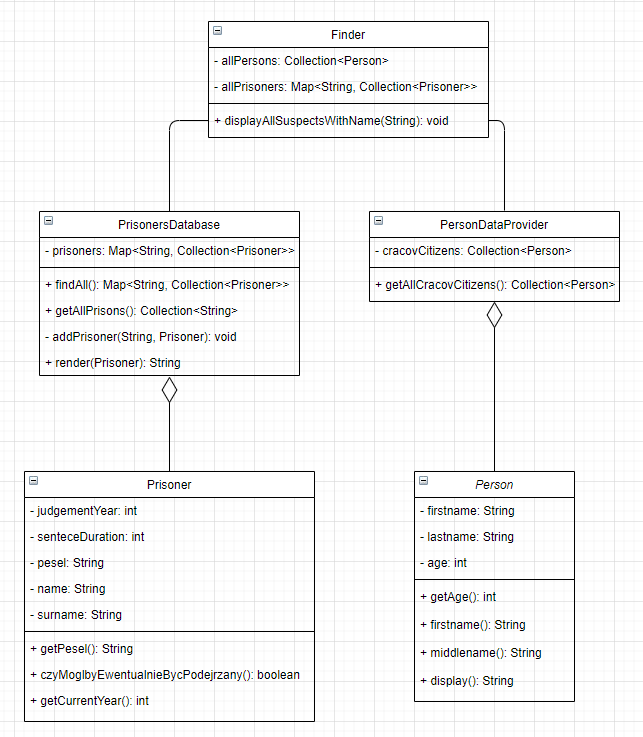
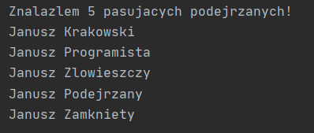
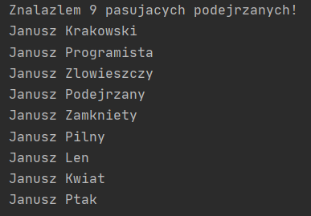
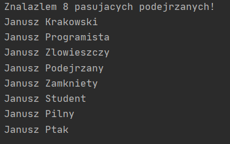

# Projektowanie obiektowe - Refaktoryzacja
## Aleksandra Mazur

### 1. Diagram UML na podstawie analizy kodu



<div style="page-break-after: always;"></div>

Proponowane zmiany:
* zmiana polskich nazw metod i atrybutów na angielskie: `czyMoglbyEwentualnieBycPodejrzany()`, `pesel`
* zmiana nazw niektórych metod na bardziej czytelne: `firstname()`, `middlename()`
* generalizacja klas `Prisoner` i `Person`

<div style="page-break-after: always;"></div>

### 2. Poprawa podstawowych błędów w kodzie

#### Klasa `Person`
* zmieniono nazwę klasy na `CracowCitizen`
* zostawiono prywatne pola
* atrybut `firstname` zmieniono na `name`, a `lastname` na `surname`
* nazwy metod `firstname()` i `middlename()` zmieniono odpowiednio na `getFirstName()` i `getSurname()`

```java
package pl.edu.agh.to.lab4;

public class CracowCitizen {
    private String name;

    private String surname;

    private int age;

    public CracowCitizen(String name, String surname, int age) {
        this.age = age;
        this.name = name;
        this.surname = surname;
    }

    public int getAge() {
        return age;
    }

    public String getName() {
        return name;
    }

    public String getSurname() {
        return surname;
    }

    public String display() {
        return name + " " + surname;
    }
}
```
<div style="page-break-after: always;"></div>

#### Klasa `Prisoner`:
* nazwę atrybutu `pesel` zmieniono na `personalId`, a `senteceDuration` na `sentenceDuration`
* dodano gettery
* nazwę metody `czyMoglbyEwentualnieBycPodejrzany()` zmieniono na `isJailedNow()`
* dodano metodę `display()`

```java
package pl.edu.agh.to.lab4;

import java.util.Calendar;

public class Prisoner {
    private final int judgementYear;

    private final int sentenceDuration;

    private final String personalId;

    public final String name;

    public final String surname;

    public Prisoner(String name, String surname, String personalId, int judgementYear, int sentenceDuration) {
        this.name = name;
        this.surname = surname;
        this.personalId = personalId;
        this.judgementYear = judgementYear;
        this.sentenceDuration = sentenceDuration;
    }

    public String getPersonalId() {
        return personalId;
    }

    public boolean isJailedNow() {
        return judgementYear + sentenceDuration >= getCurrentYear();
    }

    public int getCurrentYear() {
        return Calendar.getInstance().get(Calendar.YEAR);
    }

    public String display() { return name + " " + surname; }

    public int getJudgementYear() {
        return judgementYear;
    }

    public int getSentenceDuration() {
        return sentenceDuration;
    }

    public String getName() {
        return name;
    }

    public String getSurname() {
        return surname;
    }
}
```

#### Klasa `PersonDataProvider`
```java
package pl.edu.agh.to.lab4;

import java.util.ArrayList;
import java.util.Collection;

public class PersonDataProvider {

    private final Collection<CracowCitizen> cracowCitizens = new ArrayList<CracowCitizen>();

    public PersonDataProvider() {
        cracowCitizens.add(new CracowCitizen("Jan", "Kowalski", 30));
        cracowCitizens.add(new CracowCitizen("Janusz", "Krakowski", 30));
        cracowCitizens.add(new CracowCitizen("Janusz", "Mlodociany", 10));
        cracowCitizens.add(new CracowCitizen("Kasia", "Kosinska", 19));
        cracowCitizens.add(new CracowCitizen("Piotr", "Zgredek", 29));
        cracowCitizens.add(new CracowCitizen("Tomek", "Gimbus", 14));
        cracowCitizens.add(new CracowCitizen("Janusz", "Gimbus", 15));
        cracowCitizens.add(new CracowCitizen("Alicja", "Zaczarowana", 22));
        cracowCitizens.add(new CracowCitizen("Janusz", "Programista", 77));
        cracowCitizens.add(new CracowCitizen("Pawel", "Pawlowicz", 32));
        cracowCitizens.add(new CracowCitizen("Krzysztof", "Mendel", 30));
    }

    public Collection<CracowCitizen> getAllCracovCitizens() {
        return cracowCitizens;
    }
}
```
<div style="page-break-after: always;"></div>

#### Klasa `PrisonersDatabase`:
* usunięto metodę `render(Prisoner)`

```java
package pl.edu.agh.to.lab4;

import java.util.ArrayList;
import java.util.Collection;
import java.util.HashMap;
import java.util.Map;

public class PrisonersDatabase {

    private final Map<String, Collection<Prisoner>> prisoners = new HashMap<String, Collection<Prisoner>>();

    public PrisonersDatabase() {
        addPrisoner("Wiezienie krakowskie", new Prisoner("Jan", "Kowalski", "87080452357", 2005, 7));
        addPrisoner("Wiezienie krakowskie", new Prisoner("Anita", "Wiercipieta", "84080452357", 2009, 3));
        addPrisoner("Wiezienie krakowskie", new Prisoner("Janusz", "Zlowieszczy", "92080445657", 2001, 10));
        addPrisoner("Wiezienie przedmiejskie", new Prisoner("Janusz", "Zamkniety", "802104543357", 2010, 5));
        addPrisoner("Wiezienie przedmiejskie", new Prisoner("Adam", "Future", "880216043357", 2020, 5));
        addPrisoner("Wiezienie przedmiejskie", new Prisoner("Zbigniew", "Nienajedzony", "90051452335", 2011, 1));
        addPrisoner("Wiezienie centralne", new Prisoner("Jan", "Przedziwny", "91103145223", 2009, 4));
        addPrisoner("Wiezienie centralne", new Prisoner("Janusz", "Podejrzany", "85121212456", 2012, 1));
    }

    public Map<String, Collection<Prisoner>> findAll() {
        return prisoners;
    }

    public Collection<String> getAllPrisons() {
        return prisoners.keySet();
    }

    private void addPrisoner(String category, Prisoner prisoner) {
        if (!prisoners.containsKey(category))
            prisoners.put(category, new ArrayList<Prisoner>());
        prisoners.get(category).add(prisoner);
    }
}
```
<div style="page-break-after: always;"></div>

#### Klasa `Finder`

```java
package pl.edu.agh.to.lab4;

import java.util.ArrayList;
import java.util.Collection;
import java.util.Map;

public class Finder {
    private final Collection<CracowCitizen> allCracowCitizens;

    private final Map<String, Collection<Prisoner>> allPrisoners;

    public Finder(Collection<CracowCitizen> allCracowCitizens, Map<String, Collection<Prisoner>> allPrisoners) {
        this.allCracowCitizens = allCracowCitizens;
        this.allPrisoners = allPrisoners;
    }

    public Finder(PersonDataProvider personDataProvider, PrisonersDatabase prisonersDatabase) {
        this(personDataProvider.getAllCracovCitizens(), prisonersDatabase.findAll());
    }

    public void displayAllSuspectsWithName(String name) {
        ArrayList<Prisoner> suspectedPrisoners = new ArrayList<Prisoner>();
        ArrayList<CracowCitizen> suspectedCracowCitizens = new ArrayList<CracowCitizen>();

        for (Collection<Prisoner> prisonerCollection : allPrisoners.values()) {
            for (Prisoner prisoner : prisonerCollection) {
                if (!prisoner.isJailedNow() && prisoner.name.equals(name)) {
                    suspectedPrisoners.add(prisoner);
                }
                if (suspectedPrisoners.size() >= 10) {
                    break;
                }
            }
            if (suspectedPrisoners.size() >= 10) {
                break;
            }
        }

        if (suspectedPrisoners.size() < 10) {
            for (CracowCitizen cracowCitizen : allCracowCitizens) {
                if (cracowCitizen.getAge() > 18 && cracowCitizen.getName().equals(name)) {
                    suspectedCracowCitizens.add(cracowCitizen);
                }
                if (suspectedPrisoners.size() + suspectedCracowCitizens.size() >= 10) {
                    break;
                }
            }
        }

        int numberOfSuspects = suspectedPrisoners.size() + suspectedCracowCitizens.size();
        System.out.println("Znalazlem " + numberOfSuspects + " pasujacych podejrzanych!");

        for (Prisoner prisoner : suspectedPrisoners) {
            System.out.println(prisoner.display());
        }

        for (CracowCitizen cracowCitizen : suspectedCracowCitizens) {
            System.out.println(cracowCitizen.display());
        }
    }
}
```
<div style="page-break-after: always;"></div>

### 3. Generalizacja klas `Person (CracowCitizen)` i `Prisoner`

Stworzono klasę abstrakcyjną `Suspect`, którą będą rozszerzać powyższe klasy. Wybrano klasę abstrakcyjną, a nie interfejs, ponieważ wcześniej wspomniane klasy posiadają kilka wspólnych atrybutów i metod. Uniknie to powtarzania kodu.

* Klasa abstrakcyjna `Suspect`:

```java
package pl.edu.agh.to.lab4;

public abstract class Suspect {
    private final String name;
    
    private final String surname;

    public Suspect(String name, String surname) {
        this.name = name;
        this.surname = surname;
    }

    public String getName() {
        return name;
    }

    public String getSurname() {
        return surname;
    }

    public String display() {
        return name + " " + surname;
    }
}
```
<div style="page-break-after: always;"></div>

* Klasa `CracowCitizen`:

```java
package pl.edu.agh.to.lab4;

public class CracowCitizen extends Suspect {
    private int age;

    public CracowCitizen(String name, String surname, int age) {
        super(name, surname);
        this.age = age;
    }

    public int getAge() {
        return age;
    }
}
```
<div style="page-break-after: always;"></div>

* Klasa `Prisoner`:

```java
package pl.edu.agh.to.lab4;

import java.util.Calendar;

public class Prisoner extends Suspect{
    private final int judgementYear;

    private final int sentenceDuration;

    private final String personalId;

    public Prisoner(String name, String surname, String personalId, int judgementYear, int sentenceDuration) {
        super(name, surname);
        this.personalId = personalId;
        this.judgementYear = judgementYear;
        this.sentenceDuration = sentenceDuration;
    }

    public boolean isJailedNow() {
        return judgementYear + sentenceDuration >= getCurrentYear();
    }

    public int getCurrentYear() {
        return Calendar.getInstance().get(Calendar.YEAR);
    }

    public String getPersonalId() {
        return personalId;
    }

    public int getJudgementYear() {
        return judgementYear;
    }

    public int getSentenceDuration() {
        return sentenceDuration;
    }
}
```
<div style="page-break-after: always;"></div>

### 4. Wprowadzenie generalizacji do klas dostarczających dane do systemu

#### Klasa `Suspect`
Dodano:
* atrybut `age` i gettera
* abstrakcyjną metodę `canBeAccused()`

```java
package pl.edu.agh.to.lab4;

public abstract class Suspect {
    private final String name;
    private final String surname;
    private int age;

    public Suspect(String name, String surname, int age) {
        this.name = name;
        this.surname = surname;
        this.age = age;
    }

    public String getName() {
        return name;
    }

    public String getSurname() {
        return surname;
    }

    public int getAge() {
        return age;
    }

    public String display() {
        return name + " " + surname;
    }

    public abstract boolean canBeAccused();
}
```
<div style="page-break-after: always;"></div>

#### Klasa `Prisoner`

Dodano wiek w konstruktorze i implementację metody `canBeAccused()`.

```java
package pl.edu.agh.to.lab4;

import java.util.Calendar;

public class Prisoner extends Suspect{
    private final int judgementYear;

    private final int sentenceDuration;

    private final String personalId;

    public Prisoner(String name, String surname, String personalId, int judgementYear, int sentenceDuration, int age) {
        super(name, surname, age);
        this.personalId = personalId;
        this.judgementYear = judgementYear;
        this.sentenceDuration = sentenceDuration;
    }

    public boolean isJailedNow() {
        return judgementYear + sentenceDuration >= getCurrentYear();
    }

    public int getCurrentYear() {
        return Calendar.getInstance().get(Calendar.YEAR);
    }

    public String getPersonalId() {
        return personalId;
    }

    public int getJudgementYear() {
        return judgementYear;
    }

    public int getSentenceDuration() {
        return sentenceDuration;
    }

    @Override
    public boolean canBeAccused() {
        return !isJailedNow();
    }
}
```

<div style="page-break-after: always;"></div>

#### Klasa `CracowCitizen`

Dodano implementację metody `canBeAccused()`.

```java
package pl.edu.agh.to.lab4;

public class CracowCitizen extends Suspect {

    public CracowCitizen(String name, String surname, int age) {
        super(name, surname, age);
    }

    @Override
    public boolean canBeAccused() {
        return this.getAge() > 18;
    }

}
```

#### Klasa `FlatIterator`

Stworzono klasę implementującą interfejs `Iterator` i zaimplementowano metody `hasNext()` i `next()`.

Klasa ta posiada poniższe atrybuty:
* Map<String, Collection\<Prisoner>> prisoners
* Prisoner currentPrisoner - obecny więzień
* int numberOfPrisoners - liczba więźniów (zwiększana po dodaniu więźnia i zmniejszana po przeiterowaniu przez danego więźnia)

```java
package pl.edu.agh.to.lab4;

import java.util.Collection;
import java.util.Iterator;
import java.util.Map;

public class FlatIterator implements Iterator<Suspect> {
    protected final Map<String, Collection<Prisoner>> prisoners;
    private Prisoner currentPrisoner = null;
    protected int numberOfPrisoners = 0;

    public FlatIterator(Map<String, Collection<Prisoner>> prisoners){
        this.prisoners = prisoners;
    }

    @Override
    public boolean hasNext() {
        return this.numberOfPrisoners != 0;
    }

    @Override
    public Suspect next() {
        this.numberOfPrisoners --;
        for (String key: this.prisoners.keySet()){
            for (Prisoner prisoner: this.prisoners.get(key)){
                if (this.currentPrisoner == null){
                    this.currentPrisoner = prisoner;
                    return prisoner;
                }
                else if (this.currentPrisoner == prisoner){
                    this.currentPrisoner = null;
                }
            }
        }
        return null;
    }
}
```

#### Klasa `SuspectAggregate`

Stworzono poniższy interfejs.

```java
package pl.edu.agh.to.lab4;

import java.util.Iterator;

public interface SuspectAggregate {
    Iterator<? extends Suspect> iterator();
}
```

#### Klasa `PersonDataProvider`

Zmodyfikowano klasę, tak aby implementowała interfejs `SuspectAggregate`.

```java
package pl.edu.agh.to.lab4;

import java.util.ArrayList;
import java.util.Collection;
import java.util.Iterator;

public class PersonDataProvider implements SuspectAggregate{

    private final Collection<CracowCitizen> cracowCitizens = new ArrayList<CracowCitizen>();

    public PersonDataProvider() {
        cracowCitizens.add(new CracowCitizen("Jan", "Kowalski", 30));
        cracowCitizens.add(new CracowCitizen("Janusz", "Krakowski", 30));
        cracowCitizens.add(new CracowCitizen("Janusz", "Mlodociany", 10));
        cracowCitizens.add(new CracowCitizen("Kasia", "Kosinska", 19));
        cracowCitizens.add(new CracowCitizen("Piotr", "Zgredek", 29));
        cracowCitizens.add(new CracowCitizen("Tomek", "Gimbus", 14));
        cracowCitizens.add(new CracowCitizen("Janusz", "Gimbus", 15));
        cracowCitizens.add(new CracowCitizen("Alicja", "Zaczarowana", 22));
        cracowCitizens.add(new CracowCitizen("Janusz", "Programista", 77));
        cracowCitizens.add(new CracowCitizen("Pawel", "Pawlowicz", 32));
        cracowCitizens.add(new CracowCitizen("Krzysztof", "Mendel", 30));
    }

    public Collection<CracowCitizen> getAllCracovCitizens() {
        return cracowCitizens;
    }

    @Override
    public Iterator<? extends Suspect> iterator() {
        return this.cracowCitizens.iterator();
    }
}
```

#### Klasa `PrisonersDatabase`

Zmodyfikowano klasę, tak aby implementowała interfejs `SuspectAggregate` i rozszerzała klasę `FlatIterator`.

```java
package pl.edu.agh.to.lab4;

import java.util.*;

public class PrisonersDatabase extends FlatIterator implements SuspectAggregate {

    public PrisonersDatabase() {
        super(new HashMap<String, Collection<Prisoner>>());
        addPrisoner("Wiezienie krakowskie", new Prisoner("Jan", "Kowalski", "87080452357", 2005, 7, 33));
        addPrisoner("Wiezienie krakowskie", new Prisoner("Anita", "Wiercipieta", "84080452357", 2009, 3, 36));
        addPrisoner("Wiezienie krakowskie", new Prisoner("Janusz", "Zlowieszczy", "92080445657", 2001, 10, 28));
        addPrisoner("Wiezienie przedmiejskie", new Prisoner("Janusz", "Zamkniety", "802104543357", 2010, 5, 40));
        addPrisoner("Wiezienie przedmiejskie", new Prisoner("Adam", "Future", "880216043357", 2020, 5, 32));
        addPrisoner("Wiezienie przedmiejskie", new Prisoner("Zbigniew", "Nienajedzony", "90051452335", 2011, 1, 30));
        addPrisoner("Wiezienie centralne", new Prisoner("Jan", "Przedziwny", "91103145223", 2009, 4, 29));
        addPrisoner("Wiezienie centralne", new Prisoner("Janusz", "Podejrzany", "85121212456", 2012, 1, 35));
    }

    public Map<String, Collection<Prisoner>> findAll() {
        return prisoners;
    }

    public Collection<String> getAllPrisons() {
        return prisoners.keySet();
    }

    private void addPrisoner(String category, Prisoner prisoner) {
        this.numberOfPrisoners ++;
        if (!prisoners.containsKey(category))
            prisoners.put(category, new ArrayList<Prisoner>());
        prisoners.get(category).add(prisoner);
    }

    @Override
    public Iterator<Suspect> iterator() {
        return this;
    }
}
```

#### Klasa `Finder`

Zmodyfikowano klasę `Finder`, dostosowując ją do powyższych zmian.

```java
package pl.edu.agh.to.lab4;

import java.util.ArrayList;
import java.util.Collection;
import java.util.Iterator;
import java.util.Map;

public class Finder {
    private final Collection<CracowCitizen> allCracowCitizens;
    private final Map<String, Collection<Prisoner>> allPrisoners;
    private Iterator<? extends Suspect> allCracowCitizensIterator;
    private Iterator<? extends Suspect> allPrisonersIterator;

    public Finder(Collection<CracowCitizen> allCracowCitizens, Map<String, Collection<Prisoner>> allPrisoners) {
        this.allCracowCitizens = allCracowCitizens;
        this.allPrisoners = allPrisoners;
    }

    public Finder(PersonDataProvider personDataProvider, PrisonersDatabase prisonersDatabase) {
        this(personDataProvider.getAllCracovCitizens(), prisonersDatabase.findAll());
        this.allPrisonersIterator = prisonersDatabase.iterator();
        this.allCracowCitizensIterator = personDataProvider.iterator();
    }

    public void displayAllSuspectsWithName(String name) {
        ArrayList<Prisoner> suspectedPrisoners = new ArrayList<Prisoner>();
        ArrayList<CracowCitizen> suspectedCracowCitizens = new ArrayList<CracowCitizen>();

        while(allPrisonersIterator.hasNext()){
            Prisoner prisoner = (Prisoner) allPrisonersIterator.next();
            if (prisoner.canBeAccused() && prisoner.getName().equals(name)) {
                suspectedPrisoners.add(prisoner);
            }
            if (suspectedPrisoners.size() >= 10) {
                break;
            }
        }

        if (suspectedPrisoners.size() < 10) {
            while(allCracowCitizensIterator.hasNext()){
                CracowCitizen cracowCitizen = (CracowCitizen) allCracowCitizensIterator.next();
                if (cracowCitizen.canBeAccused() && cracowCitizen.getName().equals(name)) {
                    suspectedCracowCitizens.add(cracowCitizen);
                }
                if (suspectedPrisoners.size() + suspectedCracowCitizens.size() >= 10) {
                    break;
                }
            }
        }

        int numberOfSuspects = suspectedPrisoners.size() + suspectedCracowCitizens.size();
        System.out.println("Znalazlem " + numberOfSuspects + " pasujacych podejrzanych!");

        for (Prisoner prisoner : suspectedPrisoners) {
            System.out.println(prisoner.display());
        }

        for (CracowCitizen cracowCitizen : suspectedCracowCitizens) {
            System.out.println(cracowCitizen.display());
        }
    }
}
```
<div style="page-break-after: always;"></div>

### 5. Dodanie klasy pośredniej pomiędzy agregatami a finderem, odpowiedzialnej za agregację wszystkich osób ze wszystkich zbiorów danych i przekazanie ich do iteratora.

#### Klasa `CompositeAggregate`

Dodano klasę implementującą interfejs `SuspectAggregate`.

```java
package pl.edu.agh.to.lab4;

import java.util.Iterator;

public class CompositeAggregate implements SuspectAggregate {
    private final Iterator<?extends Suspect> iterators[];
    private  int currentIterator;

    public CompositeAggregate(Iterator<? extends Suspect> ... iterators){
        this.iterators = iterators;
        this.currentIterator = 0;
    }

    public boolean hasNext(){
        while(currentIterator < iterators.length && !iterators[currentIterator].hasNext()){
            currentIterator ++;
        }
        return currentIterator < iterators.length;
    }

    @Override
    public Iterator<? extends Suspect> iterator() {
        while(currentIterator < iterators.length && !iterators[currentIterator].hasNext()){
            currentIterator ++;
        }
        return iterators[currentIterator];
    }
}
```
<div style="page-break-after: always;"></div>

### Klasa `Finder`

Uproszczono klasę `Finder`.

```java
package pl.edu.agh.to.lab4;

import java.util.ArrayList;
import java.util.Iterator;

public class Finder {
    private final CompositeAggregate compositeAggregate;

    public Finder(Iterator<? extends Suspect> ... iterators) {
        this.compositeAggregate = new CompositeAggregate(iterators);
    }

    public void displayAllSuspectsWithName(String name) {
        ArrayList<Suspect> suspects = new ArrayList<Suspect>();

        while(compositeAggregate.hasNext()){
            Iterator<?extends Suspect> iterator = compositeAggregate.iterator();
            while(iterator.hasNext()){
                Suspect suspect = iterator.next();
                if (suspect.canBeAccused() && suspect.getName().equals(name)){
                    suspects.add(suspect);
                }
                if (suspects.size() >= 10) break;
            }
            if (suspects.size() >= 10) break;
        }

        System.out.println("Znalazlem " + suspects.size() + " pasujacych podejrzanych!");

        for(Suspect suspect: suspects){
            System.out.println(suspect.display());
        }
    }
}
```
<div style="page-break-after: always;"></div>

#### Klasa `Application`

```java
package pl.edu.agh.to.lab4;

import pl.edu.agh.to.lab4.dataProviders.PersonDataProvider;
import pl.edu.agh.to.lab4.dataProviders.PrisonersDatabase;

public class Application {

    public static void main(String[] args) {
        Finder suspects = new Finder(new PersonDataProvider().iterator(), new PrisonersDatabase().iterator());
        suspects.displayAllSuspectsWithName("Janusz");
    }
}
```

Wynik wywołania:



<div style="page-break-after: always;"></div>

### 6. Wsparcie możliwości łatwego dodawania warunków wyszukiwania.

#### Klasa `Student`

Dodano klasę `Student` jak poniżej.

```java
package pl.edu.agh.to.lab4.suspects;

public class Student extends Suspect {
    private final String index;

    public Student(String name, String surname, int age, String index) {
        super(name, surname, age);
        this.index = index;
    }

    @Override
    public boolean canBeAccused() {
        return true;
    }

    public String getIndex() {
        return index;
    }
}
```

#### Klasa `StudentDataProvider`

Dodano klasę dostarczającą danych o studentach.

```java
package pl.edu.agh.to.lab4.dataProviders;

import pl.edu.agh.to.lab4.Student;
import pl.edu.agh.to.lab4.SuspectAggregate;
import pl.edu.agh.to.lab4.suspects.Suspect;

import java.util.ArrayList;
import java.util.Collection;
import java.util.Iterator;

public class StudentDataProvider implements SuspectAggregate {

    private final Collection<Student> students = new ArrayList<Student>();

    public StudentDataProvider() {
        students.add(new Student("Jan", "Student", 24, "305123"));
        students.add(new Student("Janusz", "Pilny", 30, "305124"));
        students.add(new Student("Janusz", "Len", 20, "305125"));
        students.add(new Student("Kasia", "Imprezowa", 21, "305126"));
        students.add(new Student("Piotr", "Nowak", 22, "305127"));
        students.add(new Student("Tomek", "Kwiatkowski", 23, "305128"));
        students.add(new Student("Janusz", "Kwiat", 24, "305129"));
        students.add(new Student("Alicja", "Czar", 25, "305133"));
        students.add(new Student("Janusz", "Ptak", 22, "305143"));
        students.add(new Student("Pawel", "Gawlowski", 21, "305153"));
        students.add(new Student("Krzysztof", "Kot", 20, "305163"));
    }

    public Collection<Student> getStudents() {
        return students;
    }

    @Override
    public Iterator<? extends Suspect> iterator() {
        return this.students.iterator();
    }
}
```

#### Klasa `Application`

Zmodyfikowano klasę `Application` tak, aby przekazywała do `Findera` dane o studentach.

```java
package pl.edu.agh.to.lab4;

import pl.edu.agh.to.lab4.dataProviders.PersonDataProvider;
import pl.edu.agh.to.lab4.dataProviders.PrisonersDatabase;
import pl.edu.agh.to.lab4.dataProviders.StudentDataProvider;

public class Application {

    public static void main(String[] args) {
        Finder suspects = new Finder(new PersonDataProvider().iterator(), new PrisonersDatabase().iterator(), new StudentDataProvider().iterator());
        suspects.displayAllSuspectsWithName("Janusz");
    }
}
```
<div style="page-break-after: always;"></div>

Wynik wywołania:



Jak widać program działa poprawnie.

#### Interfejs `SearchStrategy`

Stworzono nowy interfejs, pomocny przy filtrowaniu danych, posiadający metodę `filter()`.

```java
package pl.edu.agh.to.lab4.searching;

import pl.edu.agh.to.lab4.suspects.Suspect;

public interface SearchStrategy {
    boolean filter(Suspect suspect);
}
```

#### Klasa `AgeSearchStrategy`

Stworzono klasę implementującą interfejs `SearchStrategy`, filtrującą podejrzanych po wieku.

```java
package pl.edu.agh.to.lab4.searching;

import pl.edu.agh.to.lab4.suspects.Suspect;

public class AgeSearchStrategy implements SearchStrategy {
    private int age;

    public AgeSearchStrategy(int age) {
        this.age = age;
    }

    @Override
    public boolean filter(Suspect suspect) {
        return suspect.getAge() > age;
    }
}
```

#### Klasa `NameSearchStrategy`

Stworzono klasę implementującą interfejs `SearchStrategy`, filtrującą podejrzanych po imieniu.

```java
package pl.edu.agh.to.lab4.searching;

import pl.edu.agh.to.lab4.suspects.Suspect;

public class NameSearchStrategy implements SearchStrategy{
    private String name;

    public NameSearchStrategy(String name) {
        this.name = name;
    }

    @Override
    public boolean filter(Suspect suspect) {
        return suspect.getName().equals(this.name);
    }
}
```

#### Klasa `CompositeSearchStrategy`

Stworzono klasę implementującą interfejs `SearchStrategy` łączącą różne filtry.

```java
package pl.edu.agh.to.lab4.searching;

import pl.edu.agh.to.lab4.suspects.Suspect;

import java.util.ArrayList;
import java.util.Collection;

public class CompositeSearchStrategy implements SearchStrategy{
    Collection<SearchStrategy> searchStrategies = new ArrayList<>();
    public void addStrategy(SearchStrategy searchStrategy){
        searchStrategies.add(searchStrategy);
    }

    @Override
    public boolean filter(Suspect suspect) {
        for(SearchStrategy searchStrategy: searchStrategies)
            if(!searchStrategy.filter(suspect))
                return false;
        return true;
    }
}
```
<div style="page-break-after: always;"></div>

#### Klasa `Finder`

Zmodyfikowano klasę `Finder` dostosowując ją do wprowadzonych zmian.

```java
package pl.edu.agh.to.lab4;

import pl.edu.agh.to.lab4.dataProviders.PersonDataProvider;
import pl.edu.agh.to.lab4.dataProviders.PrisonersDatabase;
import pl.edu.agh.to.lab4.searching.SearchStrategy;
import pl.edu.agh.to.lab4.suspects.Suspect;

import java.util.ArrayList;
import java.util.Iterator;

public class Finder {
    private final CompositeAggregate compositeAggregate;

    public Finder(Iterator<? extends Suspect> ... iterators) {
        this.compositeAggregate = new CompositeAggregate(iterators);
    }

    public void display(SearchStrategy searchStrategy) {
        ArrayList<Suspect> suspects = new ArrayList<Suspect>();

        while(compositeAggregate.hasNext()){
            Iterator<?extends Suspect> iterator = compositeAggregate.iterator();
            while(iterator.hasNext()){
                Suspect suspect = iterator.next();
                if (suspect.canBeAccused() && searchStrategy.filter(suspect)){
                    suspects.add(suspect);
                }
                if (suspects.size() >= 10) break;
            }
            if (suspects.size() >= 10) break;
        }

        System.out.println("Znalazlem " + suspects.size() + " pasujacych podejrzanych!");

        for(Suspect suspect: suspects){
            System.out.println(suspect.display());
        }
    }
}
```
<div style="page-break-after: always;"></div>

#### Klasa `Application`

Zmodyfikowano klasę `Application` tak, aby korzystała z nowo utworzonych klas.

```java
package pl.edu.agh.to.lab4;

import pl.edu.agh.to.lab4.dataProviders.PersonDataProvider;
import pl.edu.agh.to.lab4.dataProviders.PrisonersDatabase;
import pl.edu.agh.to.lab4.dataProviders.StudentDataProvider;
import pl.edu.agh.to.lab4.searching.AgeSearchStrategy;
import pl.edu.agh.to.lab4.searching.CompositeSearchStrategy;
import pl.edu.agh.to.lab4.searching.NameSearchStrategy;

public class Application {

    public static void main(String[] args) {
        Finder suspects = new Finder(new PersonDataProvider().iterator(), new PrisonersDatabase().iterator(), new StudentDataProvider().iterator());
        CompositeSearchStrategy compositeSearchStrategy = new CompositeSearchStrategy();
        compositeSearchStrategy.addStrategy(new AgeSearchStrategy(20));
        compositeSearchStrategy.addStrategy(new NameSearchStrategy("Janusz"));
        suspects.display(compositeSearchStrategy);
    }
}
```

Wynik wywołania:



Jak widać program działa poprawnie i został znacznie zoptymalizowany.