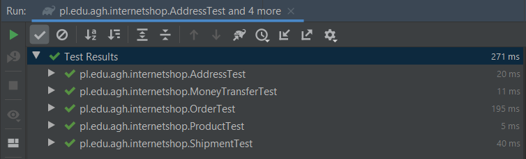
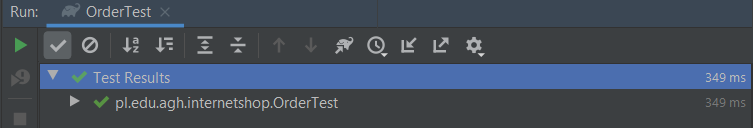
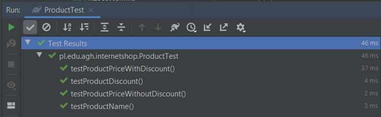
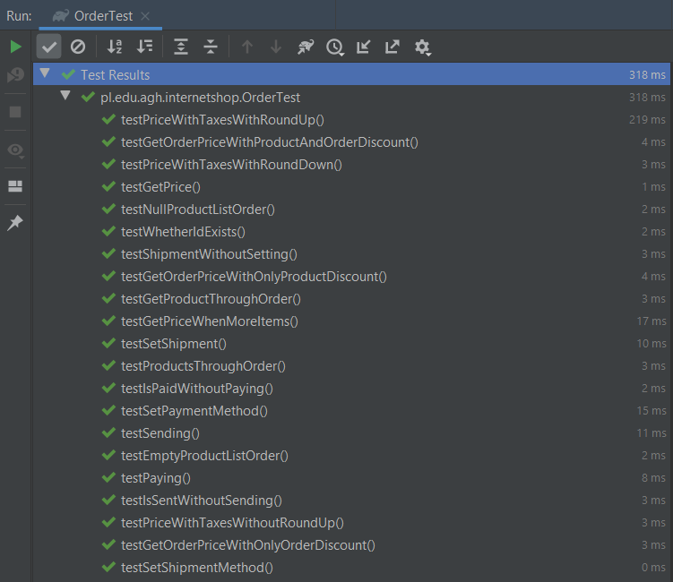
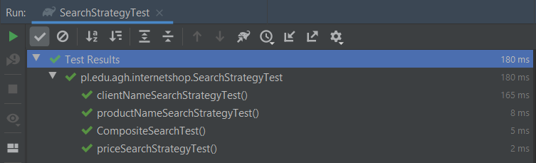
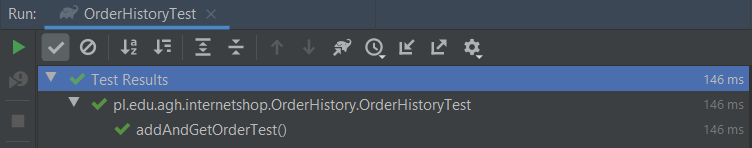
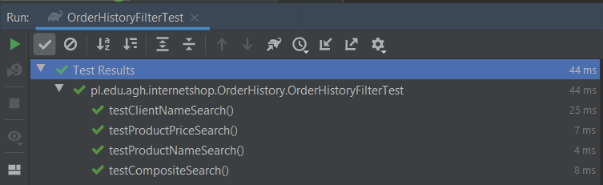

# Projektowanie obiektowe - Testy jednostkowe
## Aleksandra Mazur, Grzegorz Poręba

### 1. Zmienić wartość procentową naliczanego podatku z 22% na 23%. Należy zweryfikować przypadki brzegowe przy zaokrągleniach.

Zmodyfikowano wartość podatku z 22% na 23% w klasie `Order`.

```java
public class Order {
    private static final BigDecimal TAX_VALUE = BigDecimal.valueOf(1.23);
	private final UUID id;
    private final List<Product> products;
    private boolean paid;
    private Shipment shipment;
    private ShipmentMethod shipmentMethod;
    private PaymentMethod paymentMethod;

    public Order(List<Product> products) {
        this.products = products;
        id = UUID.randomUUID();
        paid = false;
    }
    ...
```

Zmieniono test `testPriceWithTaxesWithoutRoundUp()`, który zwróciłby błąd po zmianie podatku.

```java
@Test
    public void testPriceWithTaxesWithoutRoundUp() {
        // given

        // when
        Order order = getOrderWithCertainProductPrice(2); // 2 PLN

        // then
        assertBigDecimalCompareValue(order.getPriceWithTaxes(), BigDecimal.valueOf(2.46)); // 2.46 PLN
    }
```

<div style="page-break-after: always;"></div>

Po wprowadzonych zmianach wszystkie test przebiegły pomyślnie.



<div style="page-break-after: always;"></div>

### 2. Rozszerzyć funkcjonalność systemu, tak aby zamówienie mogło obejmować więcej niż jeden produkt na raz.

Zmodyfikowano klasę `Order`, tak aby zamiast pojedynczego produktu przechowywała listę produktów. Jednak nie zaimplementowano jeszcze wszystkich metod, na które wpłynęła ta zmiana. Przerobiono je tylko tak, żeby testy się kompilowały.

```java
public class Order {
    private static final BigDecimal TAX_VALUE = BigDecimal.valueOf(1.23);
    private final UUID id;
    private final List<Product> products;
    private boolean paid;
    private Shipment shipment;
    private ShipmentMethod shipmentMethod;
    private PaymentMethod paymentMethod;

    public Order(List<Product> products) {
        this.products = products;
        id = UUID.randomUUID();
        paid = false;
    }

    public BigDecimal getPrice() {
        return null;
        
    }

    public BigDecimal getPriceWithTaxes() {
        return getPrice().multiply(TAX_VALUE).setScale(Product.PRICE_PRECISION, Product.ROUND_STRATEGY);
    }

    public List<Product> getProducts() {
        return this.products;
    }
    ...
}
```

<div style="page-break-after: always;"></div>

Wprowadzono modyfikację w istniejących testach i dopisano kilka dodatkowych, sprawdzająych poprawność dokonanych zmian.

```java
public class OrderTest {

    private Order getOrderWithMockedProduct() {
        Product product = mock(Product.class);
        return new Order(Collections.singletonList(product));
    }

    @Test
    public void testGetProductThroughOrder() {
        // given
        Product expectedProduct = mock(Product.class);
        Order order = new Order(Collections.singletonList(expectedProduct));

        // when
        List<Product> actualProducts = order.getProducts();

        // then
        assertSame(expectedProduct, actualProducts.get(0));
    }

    @Test
    public void testProductsThroughOrder() {
        // given
        Product expectedProduct1 = mock(Product.class);
        Product expectedProduct2 = mock(Product.class);
        Order order = new Order(Arrays.asList(expectedProduct1, expectedProduct2));

        // when
        List<Product> actualProducts = order.getProducts();

        // then
        assertEquals(actualProducts.size(), 2);
        assertSame(expectedProduct1, actualProducts.get(0));
        assertSame(expectedProduct2, actualProducts.get(1));
    }

    @Test
    public void testGetPrice() throws Exception {
        // given
        BigDecimal expectedProductPrice = BigDecimal.valueOf(1000);
        Product product = mock(Product.class);
        given(product.getPrice()).willReturn(expectedProductPrice);
        Order order = new Order(Collections.singletonList(product));

        // when
        BigDecimal actualProductPrice = order.getPrice();

        // then
        assertBigDecimalCompareValue(expectedProductPrice, actualProductPrice);
    }


    private Order getOrderWithCertainProductPrice(double productPriceValue) {
        BigDecimal productPrice = BigDecimal.valueOf(productPriceValue);
        Product product = mock(Product.class);
        given(product.getPrice()).willReturn(productPrice);
        return new Order(Collections.singletonList(product));
    }

    private Order getOrderWithCertainProductPrices(List<Double> productPriceValues) {

        List<Product> products = productPriceValues.stream()
                .map(BigDecimal::valueOf)
                .map(val -> {
                    Product product = mock(Product.class);
                    given(product.getPrice()).willReturn(val);
                    return product;
                })
                .collect(Collectors.toList());

        return new Order(products);
    }

    @Test
    public void testGetPriceWhenMoreItems() throws Exception {
        // given
        List<Double> prices = new ArrayList<>(Arrays.asList(0.2, 0.5, 2.5));
        Order order = getOrderWithCertainProductPrices(prices);

        // when
        BigDecimal actualProductPrice = order.getPrice();
        BigDecimal expectedProductPrice = prices.stream()
                .map(BigDecimal::valueOf)
                .reduce(BigDecimal.ZERO, BigDecimal::add);

        // then
        assertBigDecimalCompareValue(expectedProductPrice, actualProductPrice);
    }
}
```

<div style="page-break-after: always;"></div>

Dopisano dwa testy sprawdzające czy lista produktów nie jest pusta.

```java
    @Test
    public void testNullProductListOrder(){
        // when then
        assertThrows(NullPointerException.class, ()->{
            Order order = new Order(null);
        });
    }

    @Test
    public void testEmptyProductListOrder(){
        // given
        List<Product> products= new ArrayList<>();

        // when then
        assertThrows(IllegalArgumentException.class, ()->{
            Order order = new Order(products);
        });
    }

```

<div style="page-break-after: always;"></div>

Zaimplementowano metodę `getPrice()` w klasie `Order` i zmodyfikowano konstruktor, tak aby nie pozwalał na pustą listę produktów.

```java
public class Order {
    private static final BigDecimal TAX_VALUE = BigDecimal.valueOf(1.23);
    private final UUID id;
    private final List<Product> products;
    private boolean paid;
    private Shipment shipment;
    private ShipmentMethod shipmentMethod;
    private PaymentMethod paymentMethod;

    public Order(@NonNull List<Product> products) {
        if(products.isEmpty())
            throw new IllegalArgumentException("Product list can't be empty");
        this.products = products;
        id = UUID.randomUUID();
        paid = false;
    }
}

    public BigDecimal getPrice() {
        return products
                .stream()
                .map(Product::getPrice)
                .reduce(BigDecimal.ZERO, BigDecimal::add);
        
    }
    ...
}
```

Wszystkie testy przebiegły pomyślnie.



<div style="page-break-after: always;"></div>

## 3. Dodać możliwość naliczania rabatu do pojedynczego produktu i do całego zamówienia.

Do klasy `Order` dodano atrybut discount oraz gettera i settera.

```java
private BigDecimal discount = BigDecimal.valueOf(1);

public void setOrderDiscount(BigDecimal discount){
    this.discount = discount;
}

public BigDecimal getOrderDiscount(){
    return discount;
}
```

W klasie `Product` wprowadzono analogiczne zmiany. Dodano również konstruktor, przyjmujący dodatkowo rabat.

```java
public Product(String name, BigDecimal price, BigDecimal discount) {
        this.name = name;
        this.price = price;
        this.price.setScale(PRICE_PRECISION, ROUND_STRATEGY);
        this.discount = discount;
    }

public void setProductDiscount(BigDecimal discount) {
    this.discount = discount;
}

public BigDecimal getProductDiscount() {
    return discount;
}
```

<div style="page-break-after: always;"></div>

Dopisano kilka testów dla klasy `Product`, które sprawdzają poprawność liczenia ceny z rabatem i bez niego.

```java
    private static final BigDecimal DISCOUNT = BigDecimal.valueOf(0.76);
 
    @Test
    public void testProductPriceWithoutDiscount() throws Exception{
        //given
    	
        // when
        Product product = new Product(NAME, PRICE);
        
        // then
        assertBigDecimalCompareValue(product.getPrice(), PRICE);
    }

    @Test
    public void testProductPriceWithDiscount() throws Exception{
        //given

        // when
        Product product = new Product(NAME, PRICE, DISCOUNT);

        // then
        assertBigDecimalCompareValue(product.getPrice(), PRICE.multiply(DISCOUNT));
    }

    @Test
    public void testProductDiscount() throws Exception{
        //given

        // when
        Product product = new Product(NAME, PRICE, DISCOUNT);

        // then
        assertEquals(product.getProductDiscount(), DISCOUNT);
    }
```

<div style="page-break-after: always;"></div>

Dopisano również testy dla klasy `Order`:
* `testGetOrderPriceWithOnlyOrderDiscount()` sprawdzający poprawność ceny tylko z rabatem dla całego zamówienia
* `testGetOrderPriceWithOnlyProductDiscount()` sprawdzający poprawność ceny tylko z rabatami dla produktów
* `testGetOrderPriceWithProductAndOrderDiscount()` sprawdzający poprawność ceny z rabatami zarówno dla poszczególnych produktów, jak i całego zamówienia

```java
 @Test
    public void testGetOrderPriceWithOnlyOrderDiscount() throws Exception {
        // given
        List<Double> prices = new ArrayList<>(Arrays.asList(0.2, 0.5, 2.5));
        Order order = getOrderWithCertainProductPrices(prices);
        BigDecimal discount = BigDecimal.valueOf(0.76);
        order.setOrderDiscount(discount);

        // when
        BigDecimal actualProductPrice = order.getPrice();
        BigDecimal expectedProductPrice = prices.stream()
                .map(BigDecimal::valueOf)
                .reduce(BigDecimal.ZERO, BigDecimal::add)
                .multiply(discount);

        // then
        assertBigDecimalCompareValue(expectedProductPrice, actualProductPrice);
    }

    @Test
    public void testGetOrderPriceWithOnlyProductDiscount() throws Exception {
        // given
        List<Double> prices = new ArrayList<>(Arrays.asList(0.2, 0.5, 2.5));
        BigDecimal discount = BigDecimal.valueOf(0.76);
        Order order = getOrderWithCertainProductPricesAndDiscount(prices, discount);

        // when
        BigDecimal actualProductPrice = order.getPrice();
        BigDecimal expectedProductPrice = prices.stream()
                .map(BigDecimal::valueOf)
                .map(val -> val.multiply(discount))
                .reduce(BigDecimal.ZERO, BigDecimal::add);

        // then
        assertBigDecimalCompareValue(expectedProductPrice, actualProductPrice);
    }

    @Test
    public void testGetOrderPriceWithProductAndOrderDiscount() throws Exception {
        // given
        List<Double> prices = new ArrayList<>(Arrays.asList(0.2, 0.5, 2.5));
        BigDecimal productDiscount = BigDecimal.valueOf(0.76);
        BigDecimal orderDiscount = BigDecimal.valueOf(0.9);
        Order order =  getOrderWithCertainProductPricesAndDiscount(prices,  productDiscount);
        order.setOrderDiscount(orderDiscount);

        // when
        BigDecimal actualProductPrice = order.getPrice();
        BigDecimal expectedProductPrice = prices.stream()
                .map(BigDecimal::valueOf)
                .map(val -> val.multiply(productDiscount))
                .reduce(BigDecimal.ZERO, BigDecimal::add)
                .multiply(orderDiscount);

        // then
        assertBigDecimalCompareValue(expectedProductPrice, actualProductPrice);
    }
```

Zmodyfikowano metody `getPrice()` zarówno w klasie `Product`, jak i w klasie `Order`.

* Klasa `Product`:
```java
public BigDecimal getPrice() {
        return price.multiply(discount);
    }
```

* Klasa `Order`:
```java
public BigDecimal getPrice() {
        return products
                .stream()
                .map(Product::getPrice)
                .reduce(BigDecimal.ZERO, BigDecimal::add)
                .multiply(discount);

    }
```

<div style="page-break-after: always;"></div>

Wszystkie testy przebiegły pomyślnie.





<div style="page-break-after: always;"></div>

### 4. Umożliwić przechowywanie historii zamówień z wyszukiwaniem po: nazwie produktu, kwocie zamówienia, nazwisku zamawiającego. Wyszukiwać można przy użyciu jednego lub wielu kryteriów.

Stworzono interfejs `SearchStrategy` odpowiedzialny za filtrowanie zamówień.

```java
public interface SearchStrategy {
    boolean filter(Order order);
}
```

Następnie stworzono cztery klasy implementujące ten interfejs:
* `ClientNameSearchStrategy` - wyszukiwanie zamówienia po nazwisku zamawiającego

```java
public class ClientNameSearchStrategy implements SearchStrategy {

    private final String clientName;

    public ClientNameSearchStrategy(String clientName) {
        this.clientName=clientName;
    }

    @Override
    public boolean filter(Order order) {
        return order.getShipment()
                .getRecipientAddress()
                .getName()
                .equals(clientName);
    }
}
```

* `PriceSearchStrategy` - wyszukiwanie po kwocie zamówienia

```java
public class PriceSearchStrategy implements SearchStrategy {

    private final BigDecimal price;

    public PriceSearchStrategy(BigDecimal price) {
        this.price = price;
    }

    @Override
    public boolean filter(Order order) {
        return order.getPrice().equals(price);
    }
}
```

* `ProductNameSearchStrategy` - wyszukiwanie po nazwie produktu

```java
public class ProductNameSearchStrategy implements SearchStrategy {

    private final String productName;

    public ProductNameSearchStrategy(String productName) {
        this.productName=productName;
    }

    @Override
    public boolean filter(Order order) {
        return order.getProducts()
                .stream()
                .map(Product::getName)
                .anyMatch(prodName-> prodName.equals(this.productName));
    }
}
```

* `CompositeSearchStrategy` - filtrowanie zamówień po wielu kryteriach.

```java
public class CompositeSearchStrategy implements SearchStrategy {
    Collection<SearchStrategy> searchStrategies = new ArrayList<>();

    public void addStrategy(SearchStrategy searchStrategy) {
        searchStrategies.add(searchStrategy);
    }

    @Override
    public boolean filter(Order order) {
        return this.searchStrategies
                .stream()
                .allMatch(searchStrategy -> searchStrategy.filter(order));
    }
}
```

Następnie stworzono interfejs `OrderHistoryInterface` odpowiedzialny za przechowywanie informacji o złożonych zamówieniach.

```java
public interface OrderHistoryInterface {

    public void addOrder(Order order);
    public List<Order> findOrderByStrategy(SearchStrategy strategy);
    public List<Order> getOrders();

}
```

Utworzono klasę `OrderHistory` implementującą interfejs `OrderHistoryInterface`, która jest singletonem i umożliwia przechowywanie historii zamówień oraz wyszukiwanie ich po różnych kryteriach.

```java
public class OrderHistory implements OrderHistoryInterface {

    private static OrderHistory orderHistory = null;
    private List<Order> orders;

    public OrderHistory(){
        this.orders = new ArrayList<>();
    }

    public static OrderHistory getInstance(){
        if(OrderHistory.orderHistory == null){
            OrderHistory.orderHistory = new OrderHistory();
        }
        return OrderHistory.orderHistory;
    }


    @Override
    public void addOrder(Order order) {
        orders.add(order);
    }

    @Override
    public List<Order> findOrderByStrategy(SearchStrategy strategy) {
        return this.orders.stream()
                .filter(strategy::filter)
                .collect(Collectors.toList());
    }

    @Override
    public List<Order> getOrders() {
        return this.orders;
    }
}
```

<div style="page-break-after: always;"></div>

Napisano testy dla klas implementujących interfejs `SearchStrategy`, sprawdzające poprawność filtrowania zamówień.

```java
public class SearchStrategyTest {

    @Test
    public void clientNameSearchStrategyTest() throws Exception{
        // given
        String wantedName = "Name Wanted";

        ClientNameSearchStrategy searchStrategy = new ClientNameSearchStrategy(wantedName);

        Address address1 = mock(Address.class);
        given(address1.getName()).willReturn(wantedName);
        Shipment shipment1 = mock(Shipment.class);
        given(shipment1.getRecipientAddress()).willReturn(address1);
        Order goodOrder = mock(Order.class);
        given(goodOrder.getShipment()).willReturn(shipment1);

        Address address2= mock(Address.class);
        given(address1.getName()).willReturn("wrong name");
        Shipment shipment2 = mock(Shipment.class);
        given(shipment1.getRecipientAddress()).willReturn(address2);
        Order badOrder = mock(Order.class);
        given(badOrder.getShipment()).willReturn(shipment2);


        // when then
        assertTrue(searchStrategy.filter(goodOrder));
        assertFalse(searchStrategy.filter(badOrder));

    }

    @Test
    public void productNameSearchStrategyTest() throws Exception{
        // given
        String wantedName = "Name Wanted";

        ProductNameSearchStrategy searchStrategy = new ProductNameSearchStrategy(wantedName);

        Product product1 = mock(Product.class);
        given(product1.getName()).willReturn(wantedName);
        Order goodOrder = new Order(Collections.singletonList(product1));

        Product product2 = mock(Product.class);
        given(product2.getName()).willReturn("wrong name");
        Order badOrder = new Order(Collections.singletonList(product2));

        // when then
        assertTrue(searchStrategy.filter(goodOrder));
        assertFalse(searchStrategy.filter(badOrder));

    }


    @Test
    public void priceSearchStrategyTest() throws Exception{
        // given
        BigDecimal wantedPrice = BigDecimal.valueOf(2.1);

        PriceSearchStrategy searchStrategy = new PriceSearchStrategy(wantedPrice);

        Product product1 = mock(Product.class);
        given(product1.getPrice()).willReturn(wantedPrice);
        Order goodOrder = new Order(Collections.singletonList(product1));

        Product product2 = mock(Product.class);
        given(product2.getPrice()).willReturn(BigDecimal.valueOf(3.7));
        Order badOrder = new Order(Collections.singletonList(product2));

        // when then
        assertFalse(searchStrategy.filter(badOrder));
        assertTrue(searchStrategy.filter(goodOrder));
    }

    @Test
    public void CompositeSearchTest() {
        // given
        String wantedName = "Name Wanted";
        BigDecimal wantedPrice = BigDecimal.valueOf(2.1);

        PriceSearchStrategy priceSearchStrategy = new PriceSearchStrategy(wantedPrice);
        ProductNameSearchStrategy nameSearchStrategy = new ProductNameSearchStrategy(wantedName);
        CompositeSearchStrategy searchStrategy = new CompositeSearchStrategy();

        Product product1 = mock(Product.class);
        given(product1.getName()).willReturn(wantedName);
        given(product1.getPrice()).willReturn(wantedPrice);
        Order goodOrder = new Order(Collections.singletonList(product1));

        Product product2 = mock(Product.class);
        given(product2.getName()).willReturn("wrong name");
        given(product2.getPrice()).willReturn(wantedPrice);
        Order badOrder1 = new Order(Collections.singletonList(product2));

        Product product3 = mock(Product.class);
        given(product3.getName()).willReturn(wantedName);
        given(product3.getPrice()).willReturn(BigDecimal.valueOf(3.7));
        Order badOrder2 = new Order(Collections.singletonList(product3));

        // when
        searchStrategy.addStrategy(priceSearchStrategy);
        searchStrategy.addStrategy(nameSearchStrategy);

        // then
        assertTrue(searchStrategy.filter(goodOrder));
        assertFalse(searchStrategy.filter(badOrder1));
        assertFalse(searchStrategy.filter(badOrder2));
    }
}
```

Test dla klasy `OrderHistory`, sprawdzający poprawność przechowywanych zamówień.

```java
class OrderHistoryTest {

    @Test
    void addAndGetOrderTest() {
        // given
        Order expectedOrder = mock(Order.class);
        OrderHistory orderHistory = new OrderHistory();
        orderHistory.addOrder(expectedOrder);
        
        // when
        Order actualOrder = orderHistory.getOrders().get(0);

        // then
        assertEquals(expectedOrder, actualOrder);
    }
}
```

<div style="page-break-after: always;"></div>

Testy dla klasy `OrderHistory`, sprawdzające poprawność filtrowania zamówień.

```java
public class OrderHistoryFilterTest {

    private static final String customerName1 = "Adam Smith";
    private static final String customerName2 = "Adam Nowak";

    private static final BigDecimal productPrice1 = BigDecimal.valueOf(1.2);
    private static final BigDecimal productPrice2 = BigDecimal.valueOf(1.9);

    private static final String productName1 = "Milk";
    private static final String productName2 = "Apple";

    @BeforeAll
    static void addMockOrders() {

        Product product1 = new Product(productName1, productPrice1);
        Product product2 = new Product(productName2, productPrice2);

        List<Product> list1 = new ArrayList<Product>(Arrays.asList(product1, product1, product2));
        List<Product> list2 = new ArrayList<Product>(Arrays.asList(product1, product1));


        Order order1 = new Order(list1);
        Order order2 = new Order(list2);

        Address address1 = mock(Address.class);
        given(address1.getName()).willReturn(customerName1);

        Address address2 = mock(Address.class);
        given(address2.getName()).willReturn(customerName2);

        Shipment shipment1 = mock(Shipment.class);
        given(shipment1.getRecipientAddress()).willReturn(address1);

        Shipment shipment2 = mock(Shipment.class);
        given(shipment2.getRecipientAddress()).willReturn(address2);

        order1.setShipment(shipment1);
        order2.setShipment(shipment2);
    }


    @Test
    public void testClientNameSearch() {

        // given
        ClientNameSearchStrategy searchStrategy = new ClientNameSearchStrategy(customerName1);
        OrderHistory orderHistory = OrderHistory.getInstance();

        // when
        List<Order> actualOrders = orderHistory.findOrderByStrategy(searchStrategy);
        List<Order> expectedOrders = orderHistory
                .getOrders()
                .stream()
                .filter(order -> order.getShipment().getRecipientAddress().getName().equals(customerName1))
                .collect(Collectors.toList());


        // then
        assertEquals(actualOrders.size(), expectedOrders.size());
        assertEquals(actualOrders.get(0), expectedOrders.get(0));
    }

    @Test
    public void testProductPriceSearch() {

        // given
        BigDecimal expectedPrice = BigDecimal.valueOf(1.2).add(BigDecimal.valueOf(1.2));
        PriceSearchStrategy searchStrategy = new PriceSearchStrategy(expectedPrice);
        OrderHistory orderHistory = OrderHistory.getInstance();

        // when
        List<Order> actualOrders = orderHistory.findOrderByStrategy(searchStrategy);
        List<Order> expectedOrders = orderHistory
                .getOrders()
                .stream()
                .filter(order -> order.getPrice().equals(expectedPrice))
                .collect(Collectors.toList());


        // then
        assertEquals(actualOrders.size(), expectedOrders.size());
        assertEquals(actualOrders.get(0), expectedOrders.get(0));
    }

    @Test
    public void testProductNameSearch() {

        // given
        ProductNameSearchStrategy searchStrategy = new ProductNameSearchStrategy(productName2);
        OrderHistory orderHistory = OrderHistory.getInstance();

        // when
        List<Order> actualOrders = orderHistory.findOrderByStrategy(searchStrategy);
        List<Order> expectedOrders = orderHistory
                .getOrders()
                .stream()
                .filter(order ->
                        order.getProducts()
                                .stream()
                                .anyMatch(product -> product.getName().equals(productName2))
                )
                .collect(Collectors.toList());


        // then
        assertEquals(actualOrders.size(), expectedOrders.size());
        assertEquals(actualOrders.get(0), expectedOrders.get(0));
    }

    @Test
    public void testCompositeSearch() {

        // given
        ProductNameSearchStrategy productSearchStrategy = new ProductNameSearchStrategy(productName2);
        ClientNameSearchStrategy clientSearchStrategy = new ClientNameSearchStrategy(customerName1);
        CompositeSearchStrategy searchStrategy = new CompositeSearchStrategy();
        searchStrategy.addStrategy(productSearchStrategy);
        searchStrategy.addStrategy(clientSearchStrategy);
        OrderHistory orderHistory = OrderHistory.getInstance();

        // when
        List<Order> actualOrders = orderHistory.findOrderByStrategy(searchStrategy);
        List<Order> expectedOrders = orderHistory
                .getOrders()
                .stream()
                .filter(order -> order.getShipment().getRecipientAddress().getName().equals(customerName1))
                .filter(order ->
                        order.getProducts()
                                .stream()
                                .anyMatch(product -> product.getName().equals(productName2))
                )
                .collect(Collectors.toList());


        // then
        assertEquals(actualOrders.size(), expectedOrders.size());
        assertEquals(actualOrders.get(0), expectedOrders.get(0));
    }
}
```

<div style="page-break-after: always;"></div>

Wszystkie test przebiegły pomyślnie.





