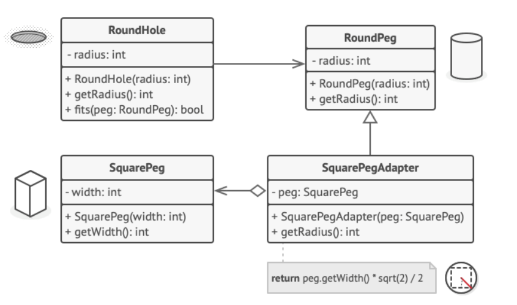
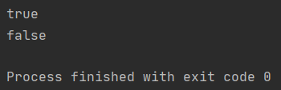
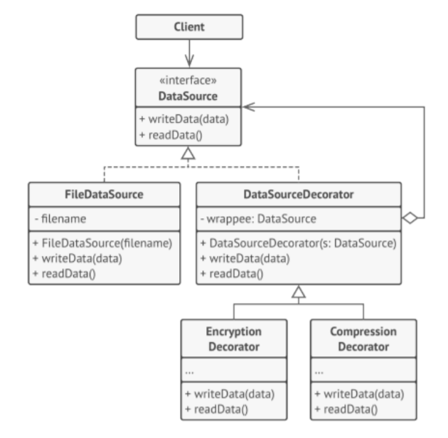
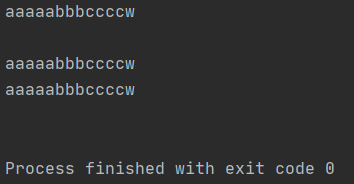
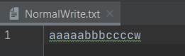
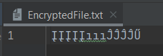
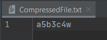
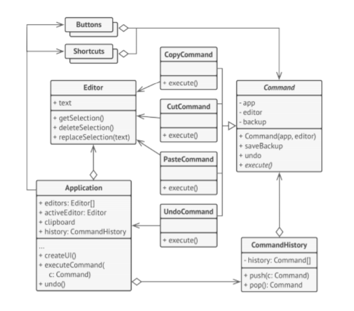
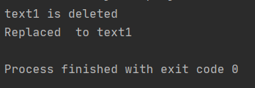

# Design patterns part II
## Aleksandra Mazur, Grzegorz Poręba

## 1. Adapter

Zaimplementowano aplikację według poniższego schematu:



Dla ułatwienia użyto biblioteki `lombok` do generacji getterów, setterów i konstruktorów.

### Klasa `RoundPeg`

```java
package org.example.ShapeAdapter;

import lombok.AllArgsConstructor;
import lombok.Getter;

@AllArgsConstructor
@Getter
public class RoundPeg {

    private int radius;

}
```

<div style="page-break-after: always;"></div>

### Klasa `SquarePegAdapter`

```java
package org.example.ShapeAdapter;

public class SquarePegAdapter extends RoundPeg {

    private SquarePeg peg;

    public SquarePegAdapter( SquarePeg peg) {
        super(peg.getWidth());
        this.peg = peg;
    }

    public int getRadius(){
        return (int) (peg.getWidth()*Math.sqrt(2.0)/2.0);
    }

}
```

### Klasa `RoundHole`

```java
package org.example.ShapeAdapter;

import lombok.AllArgsConstructor;
import lombok.Getter;

@AllArgsConstructor
@Getter
public class RoundHole {

    private int radius;

    public boolean fits(RoundPeg peg){
        return this.getRadius()>=peg.getRadius();
    }

}
```

<div style="page-break-after: always;"></div>

### Klasa `SquarePeg`

```java
package org.example.ShapeAdapter;

import lombok.AllArgsConstructor;
import lombok.Getter;

@AllArgsConstructor
@Getter
public class SquarePeg {

    private int width;
}
```

### Klasa `ShapeAdapterMain`

```java
package org.example.ShapeAdapter;


public class ShapeAdapterMain {
    public static void main(String[] args) {


        RoundHole hole = new RoundHole(5);
        RoundPeg rpeg = new RoundPeg(5);

        hole.fits(rpeg); // true

        SquarePeg small_sqpeg = new SquarePeg(5);
        SquarePeg large_sqpeg = new SquarePeg(10);

        //hole.fits(small_sqpeg);// noo compiling
        SquarePegAdapter small_sqpeg_adapter = new SquarePegAdapter(small_sqpeg);
        SquarePegAdapter large_sqpeg_adapter = new SquarePegAdapter(large_sqpeg);

        System.out.println(hole.fits(small_sqpeg_adapter)); // true
        System.out.println(hole.fits(large_sqpeg_adapter)); // false


    }
}
```

<div style="page-break-after: always;"></div>

### Efekt działania



<div style="page-break-after: always;"></div>

## 2. Decorator

Zaimplementowano aplikację według poniższego schematu:



<div style="page-break-after: always;"></div>

### Interfejs `DataSource`

```java
package org.example.Decorator;

import javax.crypto.BadPaddingException;
import javax.crypto.IllegalBlockSizeException;
import javax.crypto.NoSuchPaddingException;
import java.io.FileNotFoundException;
import java.io.IOException;
import java.security.InvalidKeyException;
import java.security.NoSuchAlgorithmException;

public interface DataSource {

    public void writeData(String data) throws IOException, NoSuchAlgorithmException, InvalidKeyException, BadPaddingException, IllegalBlockSizeException, NoSuchPaddingException;
    public String readData() throws IOException, NoSuchAlgorithmException, NoSuchPaddingException, InvalidKeyException, BadPaddingException, IllegalBlockSizeException;
}
```

<div style="page-break-after: always;"></div>

### Klasa `FileDataSource` implementująca interfejs `DataSource`

```java
package org.example.Decorator;

import lombok.AllArgsConstructor;
import lombok.Getter;

import java.io.*;

@AllArgsConstructor
@Getter
public class FileDataSource implements DataSource {
    private final String filename;

    public void writeData(String data) throws IOException {
        FileWriter fw = new FileWriter(filename);

        fw.write(data);
        fw.close();

    }

    public String readData() throws IOException {
        FileReader fr = new FileReader(filename);
        BufferedReader bufferedReader =  new BufferedReader(fr);
        StringBuilder result= new StringBuilder();
        String line = null;
        while((line = bufferedReader.readLine()) != null) {
            result.append(line);
            result.append("\n");

        }
        bufferedReader.close();
        return result.toString();
    }


}
```

<div style="page-break-after: always;"></div>

### Klasa `DataSourceDecorator` implementująca interfejs `DataSource`

```java
package org.example.Decorator.DataSourceDecorator;

import lombok.AllArgsConstructor;
import org.example.Decorator.DataSource;

import javax.crypto.BadPaddingException;
import javax.crypto.IllegalBlockSizeException;
import javax.crypto.NoSuchPaddingException;
import java.io.IOException;
import java.io.UnsupportedEncodingException;
import java.security.InvalidKeyException;
import java.security.NoSuchAlgorithmException;

@AllArgsConstructor
public class DataSourceDecorator implements DataSource {

    DataSource wrappee;


    public void writeData(String data) throws NoSuchAlgorithmException, InvalidKeyException, BadPaddingException, IllegalBlockSizeException, IOException, NoSuchPaddingException {

    }

    public String readData() throws NoSuchAlgorithmException, NoSuchPaddingException, InvalidKeyException, BadPaddingException, IllegalBlockSizeException, IOException {
        return null;
    }
}
```

<div style="page-break-after: always;"></div>

### Klasa `EncryptionDecorator` rozszerzająca `DataSourceDecorator`

Próbowano użyć kilku funkcji bibliotecznych do zaszyfrowania plików, ale po ilości otrzymywanych błędów zrezygnowano z nich i zaimplementowano własny algorytm. W zakomentowanej części jest kod używający jednej z bibliotek, który wyrzucał liczne błędy.

```java
package org.example.Decorator.DataSourceDecorator;

import org.example.Decorator.DataSource;

import javax.crypto.BadPaddingException;
import javax.crypto.IllegalBlockSizeException;
import javax.crypto.NoSuchPaddingException;
import java.io.IOException;
import java.security.InvalidKeyException;
import java.security.NoSuchAlgorithmException;

public class EncryptionDecorator extends DataSourceDecorator {
    public EncryptionDecorator(DataSource wrappee) {
        super(wrappee);
    }

    private final int multiplier = 3;
    private final int adder = 11;


    @Override
    public void writeData(String data) throws BadPaddingException, NoSuchAlgorithmException, IOException, IllegalBlockSizeException, NoSuchPaddingException, InvalidKeyException {
        wrappee.writeData(
                data.chars()
                        .mapToObj(ch -> (char) ch)
                        .map(character -> character * multiplier + adder)
                        .map(integer ->(char)((int)integer))
                        .collect(StringBuilder::new,StringBuilder::appendCodePoint,StringBuilder::append)
                        .toString());
    }

    @Override
    public String readData() throws NoSuchPaddingException, NoSuchAlgorithmException, IOException, BadPaddingException, IllegalBlockSizeException, InvalidKeyException {
        return wrappee
                .readData()
                .chars()
                .mapToObj(ch -> (char) ch)
                .map(character -> (character-adder) / multiplier )
                .map(integer ->(char)((int)integer))
                .collect(StringBuilder::new,StringBuilder::appendCodePoint,StringBuilder::append)
                .toString();
    }
/* poddalismy się
    private SecretKey secretKey;
    private Cipher cipher;

    public EncryptionDecorator(DataSource wrappee) throws NoSuchPaddingException, NoSuchAlgorithmException {
        super(wrappee);
        this.cipher = Cipher.getInstance("AES/CBC/PKCS5Padding");
        KeyGenerator keyGenerator = KeyGenerator.getInstance("AES");

        SecureRandom secureRandom = new SecureRandom();
        int keyBitSize = 256;
        keyGenerator.init(keyBitSize, secureRandom);

        secretKey = keyGenerator.generateKey();
    }

    @Override
    public void writeData(String data) throws NoSuchAlgorithmException, InvalidKeyException, BadPaddingException, IllegalBlockSizeException, IOException, NoSuchPaddingException {
        cipher.init(Cipher.ENCRYPT_MODE, secretKey);

        byte[] plainText  = data.getBytes(StandardCharsets.UTF_8);
        byte[] cipherText = cipher.doFinal(plainText);

        wrappee.writeData(new String(cipherText));
    }

    @Override
    public String readData() throws NoSuchAlgorithmException, NoSuchPaddingException, InvalidKeyException, BadPaddingException, IllegalBlockSizeException, IOException {
        String result = wrappee.readData();
        cipher.init(Cipher.DECRYPT_MODE, secretKey);
        byte[] plaintext = cipher.doFinal(result.getBytes((StandardCharsets.UTF_8)));


        return new String(plaintext);

    }*/
}
```

<div style="page-break-after: always;"></div>

### Klasa `CompressionDecorator` rozszerzająca `DataSourceDecorator`

Zaimplementowano własny algorytm do kompresji plików i założono, że tekst nie może przyjmować liczb. Algorytm zlicza ile takich samych liter znajduje się obok siebie. Jeżeli mamy tekst "aaaabbbbbc" to funkcja skompresuje to do postaci "a4b5c".

```java
package org.example.Decorator.DataSourceDecorator;

import org.example.Decorator.DataSource;
import org.example.Decorator.DataSourceDecorator.DataSourceDecorator;

import javax.crypto.BadPaddingException;
import javax.crypto.IllegalBlockSizeException;
import javax.crypto.NoSuchPaddingException;
import java.io.*;
import java.nio.charset.StandardCharsets;
import java.security.InvalidKeyException;
import java.security.NoSuchAlgorithmException;
import java.util.Arrays;
import java.util.zip.GZIPInputStream;
import java.util.zip.GZIPOutputStream;

// zakłada ze w tekscie nie ma liczb
public class CompressionDecorator extends DataSourceDecorator {
    public CompressionDecorator(DataSource wrappee) {
        super(wrappee);
    }

    @Override
    public void writeData(String data) throws BadPaddingException, NoSuchAlgorithmException, IllegalBlockSizeException, IOException, NoSuchPaddingException, InvalidKeyException {

        StringBuilder compressed = new StringBuilder();

        for (int i = 0; i < data.length(); i++) {

            char currLetter = data.charAt(i);
            int j = i + 1;
            for (; j < data.length() && data.charAt(j) == currLetter; j++) {
            }

            if (j - i > 2) {
                compressed.append(currLetter).append(j - i);
                i = j - 1;
            } else {
                compressed.append(currLetter);
            }
        }
        wrappee.writeData(compressed.toString());
    }

    @Override
    public String readData() throws NoSuchPaddingException, IOException, NoSuchAlgorithmException, IllegalBlockSizeException, BadPaddingException, InvalidKeyException {
        String readData = wrappee.readData();
        StringBuilder uncompressed = new StringBuilder();

        for (int i = 0; i < readData.length(); i++) {
            char currLetter = readData.charAt(i);
            if (Character.isDigit(currLetter)) {
                int nrOFOcc = Integer.parseInt(String.valueOf(currLetter));

                char[] repeat = new char[nrOFOcc - 1];
                Arrays.fill(repeat, readData.charAt(i - 1));
                uncompressed.append(new String(repeat));
            } else {
                uncompressed.append(currLetter);
            }
        }
        return uncompressed.toString();
    }
}
```

### Klasa `DecoratorMain`

```java
package org.example.Decorator;

import org.example.Decorator.DataSourceDecorator.CompressionDecorator;
import org.example.Decorator.DataSourceDecorator.EncryptionDecorator;

import javax.crypto.BadPaddingException;
import javax.crypto.IllegalBlockSizeException;
import javax.crypto.NoSuchPaddingException;
import java.io.IOException;
import java.security.InvalidKeyException;
import java.security.NoSuchAlgorithmException;

public class DecoratorMain {

    private static final String text = "aaaaabbbccccw";
    public static void main(String[] args) throws IOException, IllegalBlockSizeException, NoSuchPaddingException, BadPaddingException, NoSuchAlgorithmException, InvalidKeyException {
        DataSource dataSource = new FileDataSource("NormalWrite.txt");

        dataSource.writeData(text);
        System.out.println(dataSource.readData());


        FileDataSource dataSource1 = new FileDataSource("EncryptedFile.txt");
        DataSource encryptionDecorator = new EncryptionDecorator(dataSource1);
        encryptionDecorator.writeData(text);

        System.out.println( encryptionDecorator.readData());


        DataSource dataSource2 = new FileDataSource("CompressedFile.txt");
        DataSource compressionDecorator = new CompressionDecorator(dataSource2);
        compressionDecorator.writeData(text);

        System.out.println( compressionDecorator.readData());
    }
}
```


### Efekt działania









<div style="page-break-after: always;"></div>

## 3. Command

Zaimplementowano aplikację według poniższego schematu:



<div style="page-break-after: always;"></div>

### Klasa `Application`

```java
package org.example.Command;

import lombok.AllArgsConstructor;
import lombok.Getter;
import lombok.Setter;
import org.example.Command.Commands.*;

import java.util.List;
@Getter
@Setter
@AllArgsConstructor
public class Application {

    private String clipboard;
    private List<Editor> editors;
    private Editor activeEditor;
    private CommandHistory history;


    public void createUI() {

        executeCommand(new CopyCommand(this, activeEditor));

        executeCommand(new CutCommand(this, activeEditor));
        
        executeCommand(new PasteCommand(this, activeEditor));

        executeCommand(new UndoCommand(this, activeEditor));

    }

    public void executeCommand(Command command) {

        if (command.execute())
            history.push(command);
    }


    public void undo() {

        Command command = history.pop();
        if (command != null)
            command.undo();
    }
}
```

<div style="page-break-after: always;"></div>

### Klasa `CommandHistory`

```java
package org.example.Command;

import org.example.Command.Commands.Command;

import java.util.ArrayList;
import java.util.List;
import java.util.Stack;

public class CommandHistory {

    private Stack<Command> history=new Stack<>();

    public void push(Command c){
        history.push(c);
    }

    public Command pop(){
        return history.pop();
    }
}
```
<div style="page-break-after: always;"></div>

### Klasa `Editor`

```java
package org.example.Command;

import lombok.AllArgsConstructor;
import lombok.Getter;
import lombok.Setter;

@Setter
@Getter
@AllArgsConstructor
public class Editor {

    private String text;

    public String getSelection(){
        return text;
    }

    public void deleteSelection(){
        System.out.println(text + " is deleted");
        text = "";
    }

    public void replaceSelection(String toReplace){
        System.out.println("Replaced " + text + " to " + toReplace);
        text = toReplace;
    }
}
```
<div style="page-break-after: always;"></div>

### Klasa abstrakcyjna `Command`

```java
package org.example.Command.Commands;

import org.example.Command.Application;
import org.example.Command.Editor;

public abstract class Command {

    protected Application app;
    protected Editor editor;
    protected String backup;


    public Command(Application app, Editor editor) {
        this.app = app;
        this.editor = editor;
    }

    public void undo(){
        editor.setText(backup);
    }
    public void saveBackup(){
        backup=editor.getText();
    }

    public abstract boolean execute();
}
```

### Klasa `CopyCommand` rozszerzająca klasę `Command`

```java
package org.example.Command.Commands;

import org.example.Command.Application;
import org.example.Command.Editor;

public class CopyCommand extends Command {
    public CopyCommand(Application app, Editor editor) {
        super(app, editor);
    }

    @Override
    public boolean execute() {
        app.setClipboard(editor.getSelection());
        return false;
    }
}
```

### Klasa `CutCommand` rozszerzająca klasę `Command`

```java
package org.example.Command.Commands;

import org.example.Command.Application;
import org.example.Command.Editor;

public class CutCommand extends Command {
    public CutCommand(Application app, Editor editor) {
        super(app, editor);
    }

    @Override
    public boolean execute() {
        saveBackup();
        app.setClipboard(editor.getSelection());
        editor.deleteSelection();
        return true;
    }
}
```

### Klasa `PasteCommand` rozszerzająca klasę `Command`

```java
package org.example.Command.Commands;

import org.example.Command.Application;
import org.example.Command.Editor;

public class PasteCommand extends Command {
    public PasteCommand(Application app, Editor editor) {
        super(app, editor);
    }

    @Override
    public boolean execute() {
        saveBackup();
        editor.replaceSelection(app.getClipboard());
        return true;
    }
}
```
<div style="page-break-after: always;"></div>

### Klasa `UndoCommand` rozszerzająca klasę `Command`

```java
package org.example.Command.Commands;

import org.example.Command.Application;
import org.example.Command.Editor;

public class UndoCommand extends Command {
    public UndoCommand(Application app, Editor editor) {
        super(app, editor);
    }

    @Override
    public boolean execute() {
        app.undo();
        return false;

    }
}
```

### Klasa `CommandMain`

```java
package org.example.Command;

import java.util.ArrayList;
import java.util.List;

public class CommandMain {
    public static void main(String[] args) {

        CommandHistory commandHistory = new CommandHistory();
        Editor editor1 = new Editor("text1");
        Editor editor2 = new Editor("text2");
        List<Editor> editors = new ArrayList<Editor>();
        editors.add(editor1);
        editors.add(editor2);
        Application application = new Application("clipboard", editors, editor1, commandHistory);
        application.createUI();
    }
}
```
<div style="page-break-after: always;"></div>

### Efekt działania

